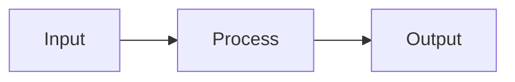

# Контрибьютинг в документацию

import { Callout, Cards, Steps, Tabs, FileTree } from 'nextra/components'

Руководство по написанию и редактированию документации SVETlANNa.

## Стек технологий

- **Next.js 16** — React-фреймворк
- **Nextra 4** — генератор документации
- **MDX** — Markdown с JSX-компонентами
- **Tailwind CSS 4** — стилизация
- **KaTeX** — рендеринг формул

---

## Структура файлов

<FileTree>
  <FileTree.Folder name="app/docs" defaultOpen>
    <FileTree.File name="_meta.js" />
    <FileTree.File name="page.mdx" />
    <FileTree.Folder name="guides" defaultOpen>
      <FileTree.File name="_meta.js" />
      <FileTree.File name="page.mdx" />
      <FileTree.Folder name="elements">
        <FileTree.File name="page.mdx" />
      </FileTree.Folder>
    </FileTree.Folder>
  </FileTree.Folder>
</FileTree>

- `_meta.js` — порядок и названия в сайдбаре
- `page.mdx` — содержимое страницы

---

## Навигация (_meta.js)

```js filename="_meta.js"
export default {
  index: "Главная",
  "getting-started": "Начало работы",
  guides: "Руководства",
  // Внешняя ссылка
  github: {
    title: "GitHub",
    href: "https://github.com/CompPhysLab/SVETlANNa",
    newWindow: true,
  },
};
```

---

## LaTeX формулы

Используется KaTeX. Инлайн: `$E = mc^2$` отрендерится как $E = mc^2$.

Блочная формула:

```latex
$$
\nabla^2 E + k^2 E = 0
$$
```

$$
\nabla^2 E + k^2 E = 0
$$

Доступные макросы:

| Макрос | Результат |
|--------|-----------|
| `\R` | $\R$ |
| `\C` | $\C$ |
| `\N` | $\N$ |
| `\Z` | $\Z$ |
| `\vec{x}` | $\vec{x}$ |

---

## Nextra компоненты

### Callout

```mdx
<Callout type="info">
  Информационное сообщение
</Callout>
```

<Callout type="info">
  Информационное сообщение
</Callout>

<Callout type="warning">
  Предупреждение
</Callout>

<Callout type="error">
  Ошибка
</Callout>

Типы: `default`, `info`, `warning`, `error`

### Cards

```mdx
<Cards>
  <Cards.Card title="Заголовок" href="/path" />
</Cards>
```

### Tabs

```mdx
<Tabs items={['Tab 1', 'Tab 2']}>
  <Tabs.Tab>Контент 1</Tabs.Tab>
  <Tabs.Tab>Контент 2</Tabs.Tab>
</Tabs>
```

<Tabs items={['Python', 'Bash']}>
  <Tabs.Tab>
    `pip install svetlanna`
  </Tabs.Tab>
  <Tabs.Tab>
    `pip install svetlanna`
  </Tabs.Tab>
</Tabs>

### Steps

```mdx
<Steps>
### Шаг 1
Описание

### Шаг 2
Описание
</Steps>
```

<Steps>
### Установка

Выполните `pip install svetlanna`

### Импорт

Добавьте `from svetlanna import SimulationParameters`
</Steps>

### FileTree

```mdx
<FileTree>
  <FileTree.Folder name="src" defaultOpen>
    <FileTree.File name="main.py" />
  </FileTree.Folder>
</FileTree>
```

---

## Блоки кода

### Подсветка синтаксиса

Используйте тройные обратные кавычки с указанием языка:

~~~
```python
def hello():
    print("Hello")
```
~~~

### Имя файла

~~~
```python filename="example.py"
print("Hello")
```
~~~

```python filename="example.py"
print("Hello")
```

### Подсветка строк

~~~
```python {2,4-5}
import torch
from svetlanna import Wavefront
params = create_params()
wf = Wavefront.plane_wave(params)
print(wf.shape)
```
~~~

```python {2,4-5}
import torch
from svetlanna import Wavefront
params = create_params()
wf = Wavefront.plane_wave(params)
print(wf.shape)
```

---

## Next.js компоненты

### Image

```jsx
import Image from 'next/image'

<Image src="/images/diagram.png" alt="Diagram" width={600} height={400} />
```

Изображения хранить в `public/images/`.

### Link

```jsx
import Link from 'next/link'

<Link href="/docs/guides">Руководства</Link>
```

Для внутренних ссылок можно использовать обычный Markdown: `[текст](/path)`.

---

## Mermaid диаграммы

~~~

~~~


---

## Локальный запуск

<Steps>
### Клонирование

```bash
git clone https://github.com/ChS23/svetlanna-docs.git
cd svetlanna-docs
```

### Установка зависимостей

```bash
pnpm install
```

### Запуск dev-сервера

```bash
pnpm dev
```

Откройте http://localhost:3000
</Steps>

---

## Рекомендации

1. Добавляйте примеры кода с реальными use-cases
2. Проверяйте сборку перед коммитом: `pnpm build`
3. Следуйте структуре существующих страниц
