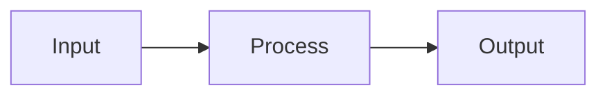

# Contributing documentation

import { Callout, Cards, Steps, Tabs, FileTree } from 'nextra/components'

How to write and edit the SVETlANNa documentation.

## Technology stack

- **Next.js 16** — the React framework
- **Nextra 4** — the documentation generator
- **MDX** — Markdown with JSX components
- **Tailwind CSS 4** — styling
- **KaTeX** — formula rendering

---

## File layout

<FileTree>
  <FileTree.Folder name="app/docs" defaultOpen>
    <FileTree.File name="_meta.js" />
    <FileTree.File name="page.mdx" />
    <FileTree.Folder name="guides" defaultOpen>
      <FileTree.File name="_meta.js" />
      <FileTree.File name="page.mdx" />
      <FileTree.Folder name="elements">
        <FileTree.File name="page.mdx" />
      </FileTree.Folder>
    </FileTree.Folder>
  </FileTree.Folder>
</FileTree>

- `_meta.js` — sidebar order and titles
- `page.mdx` — the page content

---

## Navigation (`_meta.js`)

```js filename="_meta.js"
export default {
  index: "Home",
  "getting-started": "Getting started",
  guides: "Guides",
  // an external link
  github: {
    title: "GitHub",
    href: "https://github.com/CompPhysLab/SVETlANNa",
    newWindow: true,
  },
};
```

---

## LaTeX formulas

Rendering is done with KaTeX. Inline: `$E = mc^2$` renders as $E = mc^2$.

A display formula:

```latex
$$
\nabla^2 E + k^2 E = 0
$$
```

$$
\nabla^2 E + k^2 E = 0
$$

Available macros:

| Macro | Result |
|-------|--------|
| `\R` | $\R$ |
| `\C` | $\C$ |
| `\N` | $\N$ |
| `\Z` | $\Z$ |
| `\vec{x}` | $\vec{x}$ |

---

## Nextra components

### Callout

```mdx
<Callout type="info">
  An informational note
</Callout>
```

<Callout type="info">
  An informational note
</Callout>

<Callout type="warning">
  A warning
</Callout>

<Callout type="error">
  An error
</Callout>

Types: `default`, `info`, `warning`, `error`

### Cards

```mdx
<Cards>
  <Cards.Card title="Title" href="/path" />
</Cards>
```

### Tabs

```mdx
<Tabs items={['Tab 1', 'Tab 2']}>
  <Tabs.Tab>Content 1</Tabs.Tab>
  <Tabs.Tab>Content 2</Tabs.Tab>
</Tabs>
```

<Tabs items={['pip', 'source']}>
  <Tabs.Tab>
    `pip install svetlanna`
  </Tabs.Tab>
  <Tabs.Tab>
    `pip install -e .`
  </Tabs.Tab>
</Tabs>

### Steps

```mdx
<Steps>
### Step 1
Description

### Step 2
Description
</Steps>
```

<Steps>
### Install

Run `pip install svetlanna`

### Import

Add `from svetlanna import SimulationParameters`
</Steps>

### FileTree

```mdx
<FileTree>
  <FileTree.Folder name="src" defaultOpen>
    <FileTree.File name="main.py" />
  </FileTree.Folder>
</FileTree>
```

<Callout type="warning">
MDX imports are hoisted, but keep the `import { ... } from 'nextra/components'` line at the
top of the file — right after the `#` heading — so the page stays readable.
</Callout>

---

## Code blocks

### Syntax highlighting

Use fenced blocks with a language tag:

~~~
```python
def hello():
    print("Hello")
```
~~~

### File name

~~~
```python filename="example.py"
print("Hello")
```
~~~

```python filename="example.py"
print("Hello")
```

### Line highlighting

~~~
```python {2,4-5}
import torch
from svetlanna import Wavefront
params = create_params()
wf = Wavefront.plane_wave(params)
print(wf.shape)
```
~~~

```python {2,4-5}
import torch
from svetlanna import Wavefront
params = create_params()
wf = Wavefront.plane_wave(params)
print(wf.shape)
```

---

## Images

The simplest option is relative Markdown, with the image stored next to the page:

```mdx

```

Site-wide assets live in `public/` and are referenced from the root:

```jsx
import Image from 'next/image'

<Image src="/images/diagram.png" alt="Diagram" width={600} height={400} />
```

<Callout type="info">
Figures generated from code should be reproducible: keep the script that produced them in
the page itself, so a reader can regenerate the picture.
</Callout>

---

## Jupyter notebooks

Any `.ipynb` file under `app/docs/` is converted to MDX before the build by
`lib/convert-notebooks.js`. A notebook `example.ipynb` becomes `example.notebook/page.mdx`,
with the cell outputs — including images — extracted alongside it. Reference it from
`_meta.js` as `"example.notebook"`.

The conversion runs automatically via the `predev` and `prebuild` scripts, or manually:

```bash
pnpm notebooks
```

---

## Links

Internal links use plain Markdown: `[text](/docs/guides)`.

<Callout type="warning">
When renaming or removing a page, search the repository for links to it — a broken internal
link does not fail the build.
</Callout>

---

## Mermaid diagrams

~~~

```mermaid
flowchart LR
    A[Input] --> B[Process] --> C[Output]
```
~~~


```mermaid
flowchart LR
    A[Input] --> B[Process] --> C[Output]
```

---

## Running locally

<Steps>
### Clone

```bash
git clone https://github.com/ChS23/svetlanna-docs.git
cd svetlanna-docs
```

### Install dependencies

```bash
pnpm install
```

### Start the dev server

```bash
pnpm dev
```

Open http://localhost:3000
</Steps>

---

## API reference

The pages under `/docs/api` are **generated** from the SVETlANNa docstrings by
`scripts/generate-api.py`. Do not edit them by hand — the next regeneration overwrites your
changes. Fix the docstring in the library instead, then re-run:

```bash
python scripts/generate-api.py
```

---

## Guidelines

1. Write in English.
2. Prefer examples that actually run — verify them against the installed library version.
3. Check the build before committing: `pnpm build`.
4. Follow the structure of the existing pages.
