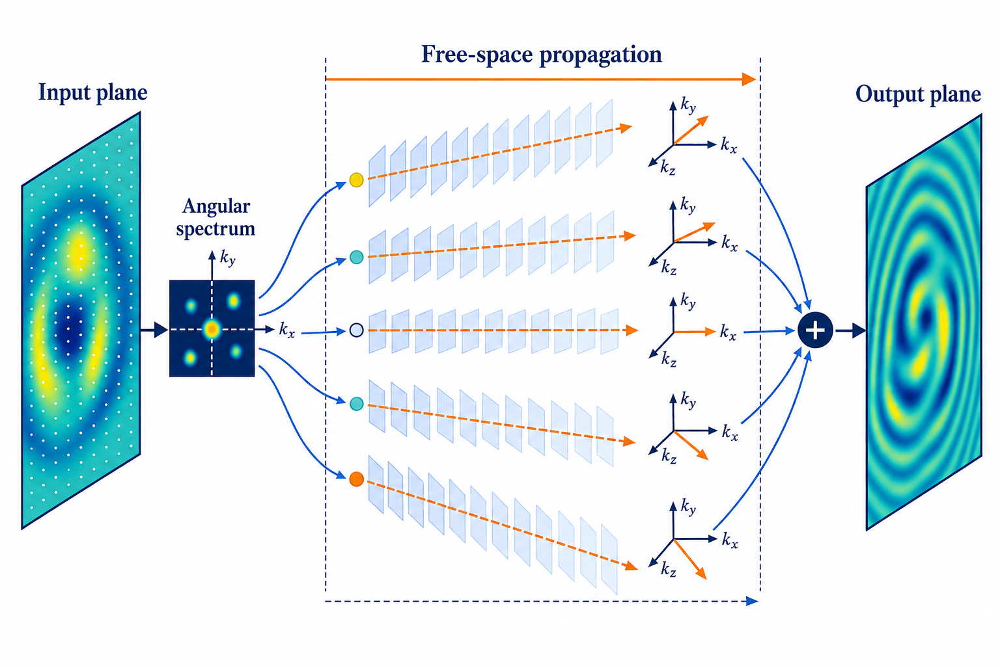

import { TrackBadges } from '../TrackBadges'
import { Comments } from '../Comments'

# Angular Spectrum Method

<TrackBadges slug="angular-spectrum" />

## The physical meaning of the Angular Spectrum Method

The previous lecture showed that the solution of the Helmholtz equation can be represented as a Rayleigh–Sommerfeld integral, which is a convolution of the field distribution at $z=0$ with a modified spherical wave. Using the convolution theorem, we can express the solution in terms of the Fourier transform of the field distribution at $z=0$:
$$
u(\boldsymbol{r}) = u(\boldsymbol{r_0}) * \dfrac{e^{ikr}}{2\pi r}\dfrac{z}{r}\left(\dfrac{1}{r} - ik\right) =\mathcal{F}^{-1}\left\{\hat{u}(\boldsymbol{k_{\perp}};0) e^{iz\sqrt{k^2 - |\boldsymbol{k_{\perp}}|^2}}\right\}(\boldsymbol{r}) = \mathcal{F}^{-1}\left\{\mathcal{F}\{u(\boldsymbol{r_0})\} e^{iz\sqrt{k^2 - |\boldsymbol{k_{\perp}}|^2}}\right\}(\boldsymbol{r})
$$

The multiplier $e^{iz\sqrt{k^2 - |\boldsymbol{k_{\perp}}|^2}}$ is called the free-space transfer function, and it describes how each spatial-frequency component of the field distribution at $z=0$ propagates to a plane at distance $z$. The term $\sqrt{k^2 - |\boldsymbol{k_{\perp}}|^2}$ represents the longitudinal component $k_z$ of the wavevector, which determines the phase accumulated by each spatial-frequency component as it propagates through free space.

The component corresponding to the spatial frequency $\boldsymbol{k_{\perp}}=(k_x,k_y)$ can be interpreted as a plane wave with amplitude $\hat{u}(\boldsymbol{k_{\perp}};0)$ and wavevector components $(k_x, k_y, k_z)$. Its direction cosines with respect to the $x$, $y$, and $z$ axes are $\cos \theta_x=\dfrac{\lambda k_x}{2\pi}$, $\cos \theta_y=\dfrac{\lambda k_y}{2\pi}$, and $\cos \theta_z=\dfrac{\lambda k_z}{2\pi}$, respectively.

*The input field is decomposed into plane-wave components, propagated independently, and recombined on the output plane.*

## Numerical computation of a diffraction field using RSCM and ASM

The Rayleigh–Sommerfeld convolution method uses convolution integrals to compute the electric field. For two-dimensional discrete signals, the complexity of direct convolution grows asymptotically as $O(N_x^2N_y^2)$, where $N_x$ and $N_y$ are the numbers of grid points in the $x$ and $y$ directions. For more efficient computation, it is better to use the fast Fourier transform (FFT), whose complexity grows as $O\!\left(N_xN_y(\log N_x+\log N_y)\right)$. However, for discrete signals, linear convolution evaluated using the convolution theorem becomes circular convolution. Hence, for RSCM (and for ASM, since it also uses the Fourier transform), zero-padding is necessary to avoid edge effects and obtain accurate results.

Consider the $\psi(x;z)$ component of the electric field. Suppose this component is sampled at $N_x$ points on an observation screen of length $L_x$. We can define the sampling interval in the spatial-coordinate domain as $\Delta_x=\dfrac{L_x}{N_x}$. According to the properties of the FFT, the sampling interval in the spatial-frequency domain along the $k_x$ direction is $\Delta_{k_x}=\dfrac{2\pi}{L_x}$. According to the Nyquist–Shannon sampling theorem, the sampling interval in the coordinate domain must satisfy the condition
$$
\Delta_{x} \leq \frac{\pi}{k_x^{max}}.
$$

Multiplying both sides by $k_x^{max}$ gives
$$
|\Delta \phi_x^{max}| \leq \pi,
$$
where $\Delta \phi_x^{max}$ is the phase shift in the $x$ direction across one grid interval. Writing the phase shift as $|\Delta \phi_x^{max}|=|\frac{\partial \phi}{\partial k_x} \Delta_{k_x}|$ allows us to rewrite the inequality as
$$
\left| \frac{\partial \phi}{\partial k_x} \Delta_{k_x} \right| \leq \pi.
$$
The ASM transfer function in the spatial-frequency domain was defined above. Substituting its phase into the Nyquist–Shannon sampling condition gives
$$
z\leq \dfrac{\pi \sqrt{k^2 - (k_x^{max})^2}}{k_x^{max} \Delta_{k_x}}.
$$
Taking into account the fact that $k_x^{max}=\dfrac{\pi}{\Delta_x}$ gives
$$
z\leq \frac{N_x (\Delta_x)^2}{\lambda}\sqrt{1-(\frac{\lambda}{2\Delta_x})^2}
$$
To avoid convolution errors, it is necessary to add a total of $M_x$ zeros ($\frac{M_x}{2}$ on each side) along the edges of the original computational grid. The Nyquist–Shannon sampling condition can then be rewritten as
$$
z\leq \frac{(N_x + M_x) (\Delta_x)^2}{\lambda}\sqrt{1-(\frac{\lambda}{2\Delta_x})^2}.
$$
If the spatial frequency of the input field at the boundary is $\frac{1}{2\Delta_x}$, its diffracted field extends beyond the observation window. The required additional range on each side can be calculated as $z\tan\theta$, where $\theta=\arcsin\left(\frac{\lambda}{2\Delta_x}\right)$. To avoid a convolution error over this range, it is necessary to add
$$
M_x=\dfrac{2z\tan\theta}{2\Delta_x}=\dfrac{z\lambda}{2(\Delta_x)^2\sqrt{1-(\frac{\lambda}{2\Delta_x})^2}}
$$
zeros ($\frac{M_x}{2}$ on each side). The number of additional zeros in the $y$ direction can be calculated similarly by substituting $\Delta_y$ and $M_y$.

It is important to note that if the number of added zeros satisfies $M_x\geq N_x$, it is preferable to use RSCM with an increased grid size. The reason for this recommendation will be discussed later.

Finally, accurate calculation of the diffraction field using ASM requires the following steps:

1. Define the $x$ and $y$ components of the electric field $\boldsymbol{E}(x,y,0)$ on a numerical grid determined by the sampling intervals $\Delta_x=\dfrac{L_x}{N_x}$ and $\Delta_y=\dfrac{L_y}{N_y}$ in each direction.
2. Add $M_x$ and $M_y$ zeros along the $x$ and $y$ directions, respectively, and ensure that $M_x \leq N_x$ and $M_y \leq N_y$.
3. Apply the 2D FFT to the $x$ and $y$ components of the electric field to obtain the Fourier transform of each component.
4. Calculate the transfer function on a numerical grid of size $L_x\times L_y$ with $(N_x+M_x)\times(N_y+M_y)$ grid points.
5. Multiply the Fourier transform of each component by the corresponding transfer function.
6. Apply the inverse 2D FFT to obtain the diffracted electric field in the coordinate domain.
7. Crop the calculated field components to the original grid size $L_x\times L_y$ with $N_x\times N_y$ grid points.

## References

- Joseph W. Goodman, *Introduction to Fourier Optics*, 4th ed., W. H. Freeman, 2017.
- Kyoji Matsushima and Tomoyoshi Shimobaba, “Band-Limited Angular Spectrum Method for Numerical Simulation of Free-Space Propagation in Far and Near Fields,” *Optics Express* 17(22), 19662–19673, 2009.
- Jason D. Schmidt, *Numerical Simulation of Optical Wave Propagation with Examples in MATLAB*, SPIE Press, 2010.

<Comments />
