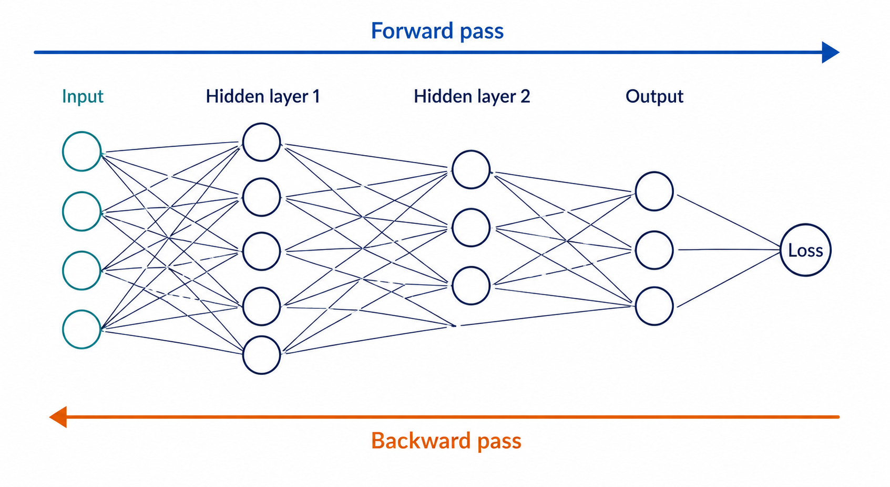

import { TrackBadges } from '../TrackBadges'
import { Comments } from '../Comments'

# Back-propagation algorithm

<TrackBadges slug="backpropagation" />

This lecture covers the back-propagation algorithm, which is a method for training fully connected neural networks. This class of neural networks usually consists of multiple layers. The first layer is called the input layer, and the last layer is called the output layer. The layers in between are called hidden layers. Each layer consists of multiple neurons connected to neurons in the previous and next layers. The connections between neurons have weights that determine how much influence a neuron has on the next layer. These neural networks are called multilayer perceptrons (MLPs) or feedforward neural networks.

Training a neural network involves finding the optimal weights that minimize the error between the predicted output and the actual output. The back-propagation algorithm consists of two main steps: the forward pass and the backward pass. In the forward pass, the input data is passed through the network to compute the output using the current weights. Consequently, error signals are computed. In the backward pass, the error signals are propagated back through the network to update the weights.

*The forward pass computes the network output and loss; the backward pass propagates derivatives toward the input layers.*

Multilayer perceptrons have three main features:

- Every neuron has a nonlinear activation function, which allows the network to learn complex patterns in the data.
- The network consists of multiple hidden layers that are not directly connected to the input or output layers.
- The network has a high degree of connectivity between layers, which allows it to learn a large number of parameters.

## Denotation

The back-propagation algorithm can be mathematically described using the following notation:

- Indices $i$, $j$, and $k$ denote neurons, where neuron $j$ follows neuron $i$, and neuron $k$ follows neuron $j$.
- Index $n$ denotes the training example.
- $\boldsymbol{E}(n)$ represents the sum of squared errors for the $n$-th training example and is called the error energy.
- $\boldsymbol{E}_{av}$ represents the average error energy over all training examples.
- $e_j(n)$ represents the error signal for neuron $j$ for the $n$-th training example.
- $y_j(n)$ represents the output of neuron $j$ for the $n$-th training example.
- $d_j(n)$ represents the desired output for neuron $j$ for the $n$-th training example.
- $w_{ji}$ represents the weight of the connection from neuron $i$ to neuron $j$.
- $\Delta w_{ji}$ represents the change in the weight of the connection from neuron $i$ to neuron $j$.
- $v_j(n)$ is the induced local field of neuron $j$ for the $n$-th training example, i.e., the weighted sum of the inputs to neuron $j$ and its bias.
- $\varphi_j(\cdot)$ represents the activation function of neuron $j$.
- $b_j=w_{j0}$ is the bias of neuron $j$.
- $x_i(n)$ represents the input to neuron $i$ for the $n$-th training example.
- $o_k(n)$ represents the output of neuron $k$ for the $n$-th training example.
- $\eta$ is the learning rate, which determines how much the weights are updated during training.
- $m_l$ is the dimension (number of nodes) of the $l$-th layer ($l=1,2,\ldots,L$); thus, $m_0$ is the number of input nodes, and $m_L$ is the number of output nodes.
- $L$ is the depth of the network.

## Common schema
The error signal of the output layer is
$$
e_j(n)=d_j(n)-y_j(n)
$$

The error energy of the output layer is
$$
\boldsymbol{E}(n)=\frac{1}{2}\sum_{j=1}^{m_L}e_j^2(n)
$$
and the average error energy over all training examples is
$$
\boldsymbol{E}_{av}=\frac{1}{N}\sum_{n=1}^N\boldsymbol{E}(n)
$$
As the error energy is a function of the weights, the average error energy is also a function of the weights. Thus, the average error energy for the current training set is a cost function that measures training effectiveness.

The induced local field of neuron $j$ is defined as the weighted sum of the inputs to neuron $j$ and its bias:
$$
v_j(n)=\sum_{i=0}^{m}w_{ji}y_i(n)
$$
where $m$ is the number of input nodes to neuron $j$.

The functional signal of neuron $j$ is defined as its output:
$$
y_j(n)=\varphi_j(v_j(n))
$$

The change in the weight of the connection from neuron $i$ to neuron $j$ can be defined using the chain rule as
$$
\Delta w_{ji}(n)=-\eta \frac{\partial \boldsymbol{E}(n)}{\partial w_{ji}(n)}=-\eta \frac{\partial \boldsymbol{E}(n)}{\partial e_j(n)}\cdot \frac{\partial e_j(n)}{\partial y_j(n)}\cdot \frac{\partial y_j(n)}{\partial v_j(n)}\cdot \frac{\partial v_j(n)}{\partial w_{ji}(n)}
$$
where $\eta$ is the learning rate, which determines how much the weights are updated during training. The negative sign indicates that we want to minimize the error energy by updating the weights in the direction of the negative gradient.

Partial derivatives in the above equation can be calculated as follows:
$$
\frac{\partial \boldsymbol{E}(n)}{\partial e_j(n)}=e_j(n)
$$
$$
\frac{\partial e_j(n)}{\partial y_j(n)}=-1
$$
$$
\frac{\partial y_j(n)}{\partial v_j(n)}=\varphi_j'(v_j(n))
$$
$$
\frac{\partial v_j(n)}{\partial w_{ji}(n)}=y_i(n)
$$

Thus, the change in the weight of the connection from neuron $i$ to neuron $j$ can be calculated as
$$
\Delta w_{ji}(n)=\eta e_j(n)\varphi_j'(v_j(n))y_i(n)=\eta \delta_j(n)y_i(n)
$$
where
$$
\delta_j(n)=e_j(n)\varphi_j'\left(v_j(n)\right) = -\dfrac{\partial \boldsymbol{E}(n)}{\partial v_j(n)}=-\frac{\partial \boldsymbol{E}(n)}{\partial e_j(n)} \cdot \frac{\partial e_j(n)}{\partial y_j(n)}\cdot \frac{\partial y_j(n)}{\partial v_j(n)}
$$
is called the local gradient of neuron $j$ for the $n$-th training example. The local gradient is a measure of how much the error energy changes with respect to the induced local field of neuron $j$.

Notice that it is possible to distinguish two cases for the local gradient of neuron $j$:

- If neuron $j$ is an output neuron, then the local gradient can be calculated using the corresponding desired output.
- If neuron $j$ is a hidden neuron, then the local gradient can be calculated using the local gradients of the neurons in the next layer and the weights of the connections from neuron $j$ to those neurons. This is because the error energy is a function of the outputs of all neurons in the network, and the output of neuron $j$ affects the outputs of all neurons in the next layer. This credit-assignment problem is solved by the back-propagation algorithm.

## The output layer

For the output layer, the local gradient can be calculated using the corresponding desired output as follows:
$$
\delta_j(n)=e_j(n)\varphi_j'\left(v_j(n)\right) = -\dfrac{\partial \boldsymbol{E}(n)}{\partial v_j(n)}=-\frac{\partial \boldsymbol{E}(n)}{\partial e_j(n)} \cdot \frac{\partial e_j(n)}{\partial y_j(n)}\cdot \frac{\partial y_j(n)}{\partial v_j(n)}
$$
where $e_j(n)=d_j(n)-y_j(n)$ is the error signal for neuron $j$ for the $n$-th training example, and $\varphi_j'(v_j(n))$ is the derivative of the activation function for neuron $j$ with respect to the induced local field.

## The hidden layer

For the hidden layer, denoted by index $j$, the local gradient can be calculated using the local gradients of the neurons in the next layer and the weights of the connections from neuron $j$ to the neurons in the next layer.

{/* Let us denote an output neuron by the index $k$. The error energy can then be calculated as follows:
$$
\boldsymbol{E}(n)=\frac{1}{2}\sum_{k=1}^{m_L}e_k^2(n)
$$
where $e_k(n)=d_k(n)-y_k(n)$ is the error signal for output neuron $k$ for the $n$-th training example, and $y_k(n)$ is the output of output neuron $k$ for the $n$-th training example. */}

First, the local gradient of neuron $j$ can be calculated using the chain rule as follows:
$$
\delta_j(n) = -\dfrac{\partial \boldsymbol{E}(n)}{\partial v_j(n)}=-\frac{\partial \boldsymbol{E}(n)}{\partial y_j(n)} \cdot \dfrac{\partial y_j(n)}{\partial v_j(n)} = -\frac{\partial \boldsymbol{E}(n)}{\partial y_j(n)} \cdot \varphi_j'(v_j(n))
$$

Let us denote an output neuron by the index $k$. The error energy can then be calculated as follows:
$$
\boldsymbol{E}(n)=\frac{1}{2}\sum_{k=1}^{m_L}e_k^2(n)
$$
where $e_k(n)=d_k(n)-y_k(n)$ is the error signal for output neuron $k$ for the $n$-th training example.

Thus, the partial derivative of the error energy with respect to the output of neuron $j$ can be calculated as follows:
$$
\frac{\partial \boldsymbol{E}(n)}{\partial y_j(n)} = \sum_{k=1}^{m_L}e_k(n) \dfrac{\partial e_k(n)}{\partial y_j(n)} = \sum_{k=1}^{m_L}e_k(n) \cdot \dfrac{\partial e_k(n)}{\partial v_k(n)} \cdot \dfrac{\partial v_k(n)}{\partial y_j(n)}
$$
where $e_k(n)=d_k(n)-y_k(n)=d_k(n)-\varphi_k(v_k(n))$ is the error signal for output neuron $k$ for the $n$-th training example. Consequently, the partial derivative of the error signal with respect to the induced local field of output neuron $k$ can be calculated as follows:
$$
\dfrac{\partial e_k(n)}{\partial v_k(n)} = -\varphi_k'(v_k(n))
$$

Also,
$$
v_k(n) = \sum_{j=0}^{m}w_{kj}y_j(n) \Rightarrow \dfrac{\partial v_k(n)}{\partial y_j(n)} = w_{kj}
$$
Substituting the equations above into the equation for $\frac{\partial \boldsymbol{E}(n)}{\partial y_j(n)}$ gives
$$
\frac{\partial \boldsymbol{E}(n)}{\partial y_j(n)} = \sum_{k=1}^{m_L}e_k(n) \cdot (-\varphi_k'(v_k(n))) \cdot w_{kj} = -\sum_{k=1}^{m_L}\delta_k(n)w_{kj}
$$
Finally, the local gradient of neuron $j$ can be calculated as follows:
$$
\delta_j(n) = \left(\sum_{k=1}^{m_L}\delta_k(n)w_{kj}\right) \cdot \varphi_j'(v_j(n))
$$
The equation above is called the back-propagation formula. It is used to calculate the local gradient of a hidden neuron from the local gradients of the neurons in the next layer and the weights of the connections between them.

## Forward pass

The forward pass of the back-propagation algorithm involves passing the input data through the network to compute the output using the current weights.

Assume that the input vector for the $n$-th training example is $\boldsymbol{x}(n)=[x_1(n), x_2(n), \ldots, x_{m_0}(n)]^T$, where $m_0$ is the number of input nodes. The output of the input layer is simply the input vector itself, i.e., $y_i(n)=x_i(n)$ for $i=1,2,\ldots,m_0$.

Next, we apply the activation function:
$$
y_j(n)=\varphi_j(v_j(n))=\varphi_j\left(\sum_{i=0}^{m}w_{ji}y_i(n)\right)
$$

If neuron $j$ belongs to the output layer, then the output of the network for the $n$-th training example is $o_j(n)=y_j(n)$ for $j=1,2,\ldots,m_L$, where $m_L$ is the number of output nodes. The error signal for an output neuron is calculated using the desired output: $e_j(n)=d_j(n)-o_j(n)$ for $j=1,2,\ldots,m_L$.

## Backward pass

The backward pass begins at the output layer, presenting it with an error signal. This signal is passed from right to left from layer to layer, with the local gradient calculated in parallel for each neuron. This recursive process involves modifying synaptic weights according to the delta rule. For a neuron located in the output layer, the local gradient is equal to the corresponding error signal multiplied by the first derivative of the nonlinear activation function.

The quantity $\Delta w_{ji}$ is then used to calculate changes in the weights associated with the output layer. Knowing the local gradients $\delta_k(n)$ for all neurons in the output layer, we can calculate the local gradients of all neurons in the previous layer and, therefore, the adjustments to the weights associated with that layer. These calculations are performed for all layers in reverse order.

However, the back-propagation algorithm itself does not specify how to update the weights, and it can be used with different optimization algorithms to find the optimal weights that minimize the error energy.
Several optimization algorithms will be covered in the next lecture.

## References

- Simon Haykin, *Neural Networks and Learning Machines*, 3rd ed., Pearson, 2009.
- David E. Rumelhart, Geoffrey E. Hinton, and Ronald J. Williams, “Learning Representations by Back-Propagating Errors,” *Nature* 323, 533–536, 1986.
- Ian Goodfellow, Yoshua Bengio, and Aaron Courville, *Deep Learning*, MIT Press, 2016.

<Comments />
