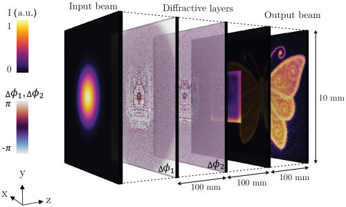

# Diffractive optical elements

Diffractive optical elements (DOEs) are optical components that manipulate light through diffraction, which is the bending and spreading of light waves as they encounter an obstacle or aperture. DOEs can be designed to perform various functions, such as focusing, beam shaping, splitting, and holography. They are typically fabricated using micro- or nano-scale structures that create specific phase shifts in the transmitted or reflected light.

Designing of several types of DOEs requires numerical methods which are based on strict solution of Maxwell's equations. The most common approach us to use Finite-Difference Time-Domain (FDTD) method, which is a numerical technique for solving Maxwell's equations in both time and space domains. FDTD allows for the accurate modeling of complex geometries and material properties, making it suitable for designing DOEs with intricate features.

Another approach is Fourier Modal Method (FMM), which is a frequency-domain method that decomposes the electromagnetic fields into a series of Fourier modes. FMM is particularly effective for analyzing periodic structures, such as gratings and photonic crystals, which are commonly used in DOEs.

In the case of scattering problem for a single particle, the T-matrix method can be used, which is a powerful technique for solving scattering problems involving particles of arbitrary shape and composition. The T-matrix method is based on the expansion of the incident and scattered fields into spherical harmonics, allowing for the calculation of scattering properties such as cross-sections and phase shifts.

However, these methods can be computationally intensive, especially for large and complex DOEs. Therefore, in the case of Fourier-optics the light diffraction on the DOEs can be described using the thin transparency approach.

## Thin transparency approach
Thin transparency approach is a simplified model for describing the diffraction of light by DOEs, assuming that the DOE doesn't transform the incident light along the optical axis $z$. Thus, the transmitted wavefront can be expressed as the product of the incident wavefront and the transmission function of the DOE:
$$u(\boldsymbol{r}) = u_0(\boldsymbol{r}) t(\boldsymbol{r})$$
where $u_0(\boldsymbol{r})$ is the incident wavefront and $t(\boldsymbol{r})$ is the transmission function of the DOE, which describes how the DOE modifies the amplitude and/or phase of the transmitted light.

The most common types of DOEs are phase-only DOEs, which modulate only the phase of the transmitted light, and amplitude-only DOEs, which modulate only the amplitude. The transmission function for a phase-only DOE can be expressed as:
$$
t(\boldsymbol{r}) = e^{i\phi(\boldsymbol{r})}
$$
where $\phi(\boldsymbol{r})$ is the phase modulation function introduced by the DOE. For an amplitude-only DOE, the transmission function can be expressed as:
$$
t(\boldsymbol{r}) = T(\boldsymbol{r})
$$
where $T(\boldsymbol{r})$ affects the amplitude of the transmitted light.

## Transmission functions of several DOEs

### Round and rectangular apertures

The transmission function of a round aperture with radius $a$ can be expressed as:
$$
t(\boldsymbol{r}) = \text{circ}(x,y,a)=\begin{cases}
1, & \text{if } \sqrt{x^2 + y^2} \leq a \\
0, & \text{otherwise}
\end{cases}
$$

The transmission function of a rectangular aperture with width $w$ and height $h$ can be expressed as:
$$
t(\boldsymbol{r}) = \text{rect}(x,y,w,h)=\begin{cases}
1, & \text{if } |x| \leq \dfrac{w}{2} \text{ and } |y| \leq \dfrac{h}{2} \\
0, & \text{otherwise}
\end{cases}
$$

These types of apertures are commonly used in optical systems for controlling the light distribution and shaping the beam profile. The diffraction patterns produced by these apertures can be analyzed using the Fourier transform of their transmission functions, which leads to the well-known Airy disk pattern for circular apertures and sinc function pattern for rectangular apertures.

## Thin lens

The transmission function of a thin lens with focal length $f$ can be expressed as:
$$
t(\boldsymbol{r}) = e^{-i\frac{k}{2f}(x^2 + y^2)}
$$

Collecting lens has a positive focal length, while diverging lens has a negative focal length. The transmission function of a thin lens introduces a quadratic phase modulation to the transmitted light, which results in the focusing or defocusing of the beam depending on the sign of the focal length. Moreover, thin collecting lens can be used to perform Fourier transform of the incident wavefront, which is a fundamental operation in Fourier optics and is widely used in various applications such as imaging, beam shaping, and optical signal processing.

## Fourier transform performed by the thin lens

Firstly, we will get the Fresnel approximation for the Angular Spectrum Method (ASM) transfer function. The ASM transfer function is given by:
$$
H(\boldsymbol{k_{\perp}}) = e^{iz\sqrt{k^2 - |\boldsymbol{k_{\perp}}|^2}}
$$

Decomposing the square root in the exponent into a Taylor series expansion:
$$
ik_z z = iz\sqrt{k^2 - |\boldsymbol{k_{\perp}}|^2} = izk\sqrt{1 - \dfrac{|\boldsymbol{k_{\perp}}|^2}{k^2}} \approx izk\left(1 - \dfrac{|\boldsymbol{k_{\perp}}|^2}{2k^2}\right) = ikz - i\dfrac{z}{2k}|\boldsymbol{k_{\perp}}|^2
$$
Thus, the Fresnel approximation for the ASM transfer function can be expressed as:
$$
H_F(\boldsymbol{k_{\perp}}) = e^{ikz} e^{-i\frac{z}{2k}|\boldsymbol{k_{\perp}}|^2}
$$
The transition described above is valid when the following condition is satisfied:
$$
\dfrac{z}{8k^3}|\boldsymbol{k_{\perp}}|^4 \ll 1
$$

Further we will get the inverse Fourier transform of the Fresnel approximation for the ASM transfer function:
$$
\begin{aligned}
h_F(\boldsymbol{r}) &= \mathcal{F}^{-1}\{H_F(\boldsymbol{k_{\perp}})\}(\boldsymbol{r}) = \dfrac{e^{ikz}}{(2\pi)^2} \int_{\mathbb{R}^2} e^{-i\frac{z}{2k}|\boldsymbol{k_{\perp}}|^2} e^{i\boldsymbol{k_{\perp}}\cdot\boldsymbol{r_{\perp}}} d\boldsymbol{k_{\perp}} = \\
&= \dfrac{e^{ikz}}{(2\pi)^2} \int_{\mathbb{R}^2} e^{-i\frac{z}{2k}(k_x^2 + k_y^2)} e^{i(k_x x + k_y y)} dk_x dk_y = \dfrac{e^{ikz}}{(2\pi)^2} \int_{\mathbb{R}} e^{-i\frac{z}{2k}k_x^2} e^{ik_x x} dk_x \int_{\mathbb{R}} e^{-i\frac{z}{2k}k_y^2} e^{ik_y y} dk_y
\end{aligned}
$$

Let's calculate the integral over $k_x$. The integral over $k_y$ can be calculated in the same way:
$$
\begin{aligned}
\int_{\mathbb{R}} e^{-i\frac{z}{2k}k_x^2} e^{ik_x x} dk_x &= \int_{\mathbb{R}} e^{-i\frac{z}{2k}\left(k_x^2 - \frac{2kx}{z}k_x\right)} dk_x = e^{i\frac{kx^2}{2z}} \int_{\mathbb{R}} e^{-i\frac{z}{2k}\left(k_x - \frac{kx}{z}\right)^2} dk_x = \\
&= e^{i\frac{kx^2}{2z}} \int_{\mathbb{R}} e^{-i\frac{z}{2k}k_x^2} dk_x \\
\end{aligned}
$$
The integral $\int_{\mathbb{R}} e^{-i\frac{z}{2k}k_x^2} dk_x$ can be calculated using the Gaussian integral formula:
$$
\int_{\mathbb{R}} e^{-i\frac{z}{2k}k_x^2} dk_x = \sqrt{\dfrac{2\pi k}{iz}} = \sqrt{\dfrac{2\pi k}{z}} e^{-i\frac{\pi}{4}}
$$

Thus, the inverse Fourier transform of the Fresnel approximation for the ASM transfer function can be expressed as:
$$
h_F(\boldsymbol{r}) = \dfrac{e^{ikz}}{(2\pi)^2} \cdot \dfrac{2\pi k}{z} e^{-i\frac{\pi}{2}} e^{i\frac{k}{2z}(x^2 + y^2)} = \dfrac{k}{2\pi z} e^{ikz} e^{-i\frac{\pi}{2}} e^{i\frac{k}{2z}(x^2 + y^2)}
$$

Further more, in the case of Fresnel approximation the field distribution at distance $z$ can be expressed as the convolution of the field distribution at $z=0$ with the inverse Fourier transform of the Fresnel approximation for the ASM transfer function:
$$
u(\boldsymbol{r}) = u(\boldsymbol{r_0}) * h_F(\boldsymbol{r}) = \dfrac{k}{2\pi z} e^{ikz} e^{-i\frac{\pi}{2}} \int_{\mathbb{R}^2} u(\boldsymbol{r_0}) e^{i\frac{k}{2z}|\boldsymbol{r} - \boldsymbol{r_0}|^2} d\boldsymbol{r_0}
$$

Secondly, we will show that the thin collecting lens performs Fourier transform of the incident wavefront. Let's consider the plane wave with amplitude $A$ incident on the object with transmission function $t(\boldsymbol{r})$, which located close to the lens. Thus, the transmitted wavefront can be expressed as:
$$
u(\boldsymbol{r}) = A t(\boldsymbol{r})
$$

Transmitted wavefront after the lens can be expressed as the product of the transmitted wavefront and the transmission function of the lens:
$$
u_L(\boldsymbol{r}) = A t(\boldsymbol{r}) e^{-i\frac{k}{2f}(x^2 + y^2)}
$$

The wavefront propagating from the lens to the plane at distance $z$ can be calculated using the Fresnel approximation for the ASM transfer function:
$$
\begin{aligned}
u(\boldsymbol{r}) &= u_L(\boldsymbol{r_0}) * h_F(\boldsymbol{r}) = \dfrac{k}{2\pi z} e^{ikz} e^{-i\frac{\pi}{2}} \int_{\mathbb{R}^2} u_L(\boldsymbol{r_0}) e^{i\frac{k}{2z}|\boldsymbol{r} - \boldsymbol{r_0}|^2} d\boldsymbol{r_0} = \\
&= \dfrac{k}{2\pi z} e^{ikz} e^{-i\frac{\pi}{2}} \int_{\mathbb{R}^2} A t(\boldsymbol{r_0}) e^{-i\frac{k}{2f}(x_0^2 + y_0^2)} e^{i\frac{k}{2z}|\boldsymbol{r} - \boldsymbol{r_0}|^2} d\boldsymbol{r_0}
\end{aligned}
$$
Expanding parentheses in an expression for $|\boldsymbol{r} - \boldsymbol{r_0}|^2$:
$$
|\boldsymbol{r} - \boldsymbol{r_0}|^2 = (x - x_0)^2 + (y - y_0)^2 = x^2 - 2xx_0 + x_0^2 + y^2 - 2yy_0 + y_0^2
$$
and substituting it into the expression for $u(\boldsymbol{r})$:
$$
\begin{aligned}
u(\boldsymbol{r}) &= \dfrac{k}{2\pi z} e^{ikz} e^{-i\frac{\pi}{2}} \int_{\mathbb{R}^2} A t(\boldsymbol{r_0}) e^{-i\frac{k}{2f}(x_0^2 + y_0^2)} e^{i\frac{k}{2z}(x^2 - 2xx_0 + x_0^2 + y^2 - 2yy_0 + y_0^2)} d\boldsymbol{r_0} = \\
&= \dfrac{k}{2\pi z} e^{ikz} e^{-i\frac{\pi}{2}} e^{i\frac{k}{2z}(x^2 + y^2)} \int_{\mathbb{R}^2} A t(\boldsymbol{r_0}) e^{-i\frac{k}{2}\left(\frac{1}{f} - \frac{1}{z}\right)(x_0^2 + y_0^2)} e^{-i\frac{k}{z}(xx_0 + yy_0)} d\boldsymbol{r_0}
\end{aligned}
$$

Finally, when the distance $z$ is equal to the focal length of the lens $f$, the expression for the field distribution at distance $z$ can be simplified as follows:
$$
u(\boldsymbol{r}) = \dfrac{k}{2\pi z} e^{ikz} e^{-i\frac{\pi}{2}} e^{i\frac{k}{2z}(x^2 + y^2)} \int_{\mathbb{R}^2} A t(\boldsymbol{r_0}) e^{-i\frac{k}{z}(xx_0 + yy_0)} d\boldsymbol{r_0}
$$
Consequently, the wavefront at distance $z$ is proportional to the Fourier transform of the transmission function of the object, which means that the thin collecting lens performs Fourier transform of the incident wavefront.

## Diffractive layer

Diffractive layer is a type of DOE that consists of a thin layer structure. The transmission function of a diffractive layer can be expressed as:
$$
t(\boldsymbol{r}) = e^{i\phi(\boldsymbol{r})}
$$
where $\phi(\boldsymbol{r})$ is the phase modulation function introduced by the diffractive layer. The phase modulation function defined by set of micro- or nano-scale structures(pixels) on the surface of the layer. Every pixel provides a specific phase shift to the transmitted light, which allows for the manipulation of the wavefront and the control of the diffraction pattern.
Unfortunately, the design of diffractive layers can be computationally intensive, especially for large and complex structures. Furthermore, the fabrication of diffractive layers with high precision can be challenging, which may limit their practical applications. Th other problem of diffractive layers is that it isn't possible to change the transmission function of the layer after its fabrication, which means that the same layer can be used only for one specific application. With aim to solve this problem, spatial light modulators (SLMs) can be used.

Example of usage of diffractive layers. Picture taken from [[1]](https://www.researchgate.net/figure/Example-setup-with-two-diffractive-layers-Delta-Phi-1-and-Delta-Phi-2-and_fig1_360987786)

## Spatial Light Modulator (SLM)
Spatial Light Modulator (SLM) is a device that can modulate the amplitude, phase, or polarization of light in a spatially resolved manner. SLMs are commonly used in various applications, such as beam shaping, holography, and optical signal processing. The transmission function of an SLM can be expressed as:
$$t(\boldsymbol{r}) = e^{i\phi(\boldsymbol{r})}$$
where $\phi(\boldsymbol{r})$ is the phase modulation function introduced by the SLM. The phase modulation function can be dynamically controlled, allowing for real-time manipulation of the wavefront and the control of the diffraction pattern. SLMs can be used to implement reconfigurable diffractive layers, which can be adapted for different applications without the need for physical fabrication.

However, SLMs have some limitations, such as limited resolution and refresh rate, which may affect their performance in certain applications. Furthermore, the phase shift provided by an every pixel of can accept only a finite number of discrete values, which can lead to quantization errors and affect the quality of the modulated wavefront. Thus, it's important to take into account these limitations when training phase masks for Diffractive Neural Networks that use spatial light modulators.
