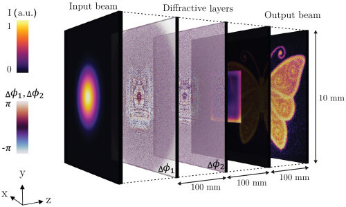

import { TrackBadges } from '../TrackBadges'
import { Comments } from '../Comments'

# Diffractive optical elements

<TrackBadges slug="diffractive-elements" />

Diffractive optical elements (DOEs) are optical components that manipulate light through diffraction, which is the bending and spreading of light waves as they encounter an obstacle or aperture. DOEs can be designed to perform various functions, such as focusing, beam shaping, splitting, and holography. They are typically fabricated using microscale or nanoscale structures that create specific phase shifts in the transmitted or reflected light.

Designing some types of DOEs requires numerical methods based on exact solutions of Maxwell's equations. The most common approach is the finite-difference time-domain (FDTD) method, which is a numerical technique for solving Maxwell's equations in both the temporal and spatial domains. FDTD enables accurate modeling of complex geometries and material properties, making it suitable for designing DOEs with intricate features.

Another approach is the Fourier modal method (FMM), which is a frequency-domain method that decomposes electromagnetic fields into a series of Fourier modes. FMM is particularly effective for analyzing periodic structures, such as gratings and photonic crystals, which are commonly used in DOEs.

For a scattering problem involving a single particle, the T-matrix method can be used. It is a powerful technique for solving scattering problems involving particles of arbitrary shape and composition. The T-matrix method is based on the expansion of the incident and scattered fields into spherical harmonics, allowing for the calculation of scattering properties such as cross sections and phase shifts.

However, these methods can be computationally intensive, especially for large and complex DOEs. Therefore, in Fourier optics, the diffraction of light by DOEs can be described using the thin-transparency approach.

## Thin transparency approach

The thin-transparency approach is a simplified model for describing the diffraction of light by DOEs. It assumes that the DOE is sufficiently thin that propagation inside it along the optical axis $z$ can be neglected. Thus, the transmitted wavefront can be expressed as the product of the incident wavefront and the transmission function of the DOE:
$$u(\boldsymbol{r}) = u_0(\boldsymbol{r}) t(\boldsymbol{r})$$
where $u_0(\boldsymbol{r})$ is the incident wavefront and $t(\boldsymbol{r})$ is the transmission function of the DOE, which describes how the DOE modifies the amplitude and/or phase of the transmitted light.

The most common types of DOEs are phase-only DOEs, which modulate only the phase of the transmitted light, and amplitude-only DOEs, which modulate only the amplitude. The transmission function for a phase-only DOE can be expressed as:
$$
t(\boldsymbol{r}) = e^{i\phi(\boldsymbol{r})}
$$
where $\phi(\boldsymbol{r})$ is the phase modulation function introduced by the DOE. For an amplitude-only DOE, the transmission function can be expressed as:
$$
t(\boldsymbol{r}) = T(\boldsymbol{r})
$$
where $T(\boldsymbol{r})$ affects the amplitude of the transmitted light.

## Transmission functions of several DOEs

### Round and rectangular apertures

The transmission function of a round aperture with radius $a$ can be expressed as:
$$
t(\boldsymbol{r}) = \text{circ}(x,y,a)=\begin{cases}
1, & \text{if } \sqrt{x^2 + y^2} \leq a \\
0, & \text{otherwise}
\end{cases}
$$

The transmission function of a rectangular aperture with width $w$ and height $h$ can be expressed as:
$$
t(\boldsymbol{r}) = \text{rect}(x,y,w,h)=\begin{cases}
1, & \text{if } |x| \leq \dfrac{w}{2} \text{ and } |y| \leq \dfrac{h}{2} \\
0, & \text{otherwise}
\end{cases}
$$

These types of apertures are commonly used in optical systems to control the light distribution and shape the beam profile. The diffraction patterns produced by these apertures can be analyzed using the Fourier transform of their transmission functions, which leads to the well-known Airy disk pattern for circular apertures and a sinc-function pattern for rectangular apertures.

## Thin lens

The transmission function of a thin lens with focal length $f$ can be expressed as:
$$
t(\boldsymbol{r}) = e^{-i\frac{k}{2f}(x^2 + y^2)}
$$

A converging lens has a positive focal length, while a diverging lens has a negative focal length. The transmission function of a thin lens introduces a quadratic phase modulation to the transmitted light, which results in focusing or defocusing of the beam depending on the sign of the focal length. Moreover, a thin converging lens can perform the Fourier transform of an incident wavefront, which is a fundamental operation in Fourier optics and is widely used in applications such as imaging, beam shaping, and optical signal processing.

## Fourier transform performed by the thin lens

First, we derive the Fresnel approximation for the angular spectrum method (ASM) transfer function. The ASM transfer function is given by
$$
H(\boldsymbol{k_{\perp}}) = e^{iz\sqrt{k^2 - |\boldsymbol{k_{\perp}}|^2}}
$$

Expanding the square root in the exponent as a Taylor series gives
$$
ik_z z = iz\sqrt{k^2 - |\boldsymbol{k_{\perp}}|^2} = izk\sqrt{1 - \dfrac{|\boldsymbol{k_{\perp}}|^2}{k^2}} \approx izk\left(1 - \dfrac{|\boldsymbol{k_{\perp}}|^2}{2k^2}\right) = ikz - i\dfrac{z}{2k}|\boldsymbol{k_{\perp}}|^2
$$
Thus, the Fresnel approximation for the ASM transfer function can be expressed as:
$$
H_F(\boldsymbol{k_{\perp}}) = e^{ikz} e^{-i\frac{z}{2k}|\boldsymbol{k_{\perp}}|^2}
$$
The transition described above is valid when the following condition is satisfied:
$$
\dfrac{z}{8k^3}|\boldsymbol{k_{\perp}}|^4 \ll 1
$$

Next, we calculate the inverse Fourier transform of the Fresnel approximation for the ASM transfer function:
$$
\begin{aligned}
h_F(\boldsymbol{r}) &= \mathcal{F}^{-1}\{H_F(\boldsymbol{k_{\perp}})\}(\boldsymbol{r}) = \dfrac{e^{ikz}}{(2\pi)^2} \int_{\mathbb{R}^2} e^{-i\frac{z}{2k}|\boldsymbol{k_{\perp}}|^2} e^{i\boldsymbol{k_{\perp}}\cdot\boldsymbol{r_{\perp}}} d\boldsymbol{k_{\perp}} = \\
&= \dfrac{e^{ikz}}{(2\pi)^2} \int_{\mathbb{R}^2} e^{-i\frac{z}{2k}(k_x^2 + k_y^2)} e^{i(k_x x + k_y y)} dk_x dk_y = \dfrac{e^{ikz}}{(2\pi)^2} \int_{\mathbb{R}} e^{-i\frac{z}{2k}k_x^2} e^{ik_x x} dk_x \int_{\mathbb{R}} e^{-i\frac{z}{2k}k_y^2} e^{ik_y y} dk_y
\end{aligned}
$$

Let's calculate the integral over $k_x$. The integral over $k_y$ can be calculated in the same way:
$$
\begin{aligned}
\int_{\mathbb{R}} e^{-i\frac{z}{2k}k_x^2} e^{ik_x x} dk_x &= \int_{\mathbb{R}} e^{-i\frac{z}{2k}\left(k_x^2 - \frac{2kx}{z}k_x\right)} dk_x = e^{i\frac{kx^2}{2z}} \int_{\mathbb{R}} e^{-i\frac{z}{2k}\left(k_x - \frac{kx}{z}\right)^2} dk_x = \\
&= e^{i\frac{kx^2}{2z}} \int_{\mathbb{R}} e^{-i\frac{z}{2k}k_x^2} dk_x \\
\end{aligned}
$$
The integral $\int_{\mathbb{R}} e^{-i\frac{z}{2k}k_x^2} dk_x$ can be calculated using the Gaussian integral formula:
$$
\int_{\mathbb{R}} e^{-i\frac{z}{2k}k_x^2} dk_x = \sqrt{\dfrac{2\pi k}{iz}} = \sqrt{\dfrac{2\pi k}{z}} e^{-i\frac{\pi}{4}}
$$

Thus, the inverse Fourier transform of the Fresnel approximation for the ASM transfer function can be expressed as:
$$
h_F(\boldsymbol{r}) = \dfrac{e^{ikz}}{(2\pi)^2} \cdot \dfrac{2\pi k}{z} e^{-i\frac{\pi}{2}} e^{i\frac{k}{2z}(x^2 + y^2)} = \dfrac{k}{2\pi z} e^{ikz} e^{-i\frac{\pi}{2}} e^{i\frac{k}{2z}(x^2 + y^2)}
$$

Furthermore, under the Fresnel approximation, the field distribution at distance $z$ can be expressed as the convolution of the field distribution at $z=0$ with the inverse Fourier transform of the approximate ASM transfer function:
$$
u(\boldsymbol{r}) = u(\boldsymbol{r_0}) * h_F(\boldsymbol{r}) = \dfrac{k}{2\pi z} e^{ikz} e^{-i\frac{\pi}{2}} \int_{\mathbb{R}^2} u(\boldsymbol{r_0}) e^{i\frac{k}{2z}|\boldsymbol{r} - \boldsymbol{r_0}|^2} d\boldsymbol{r_0}
$$

Second, we show that a thin converging lens performs the Fourier transform of an incident wavefront. Consider a plane wave with amplitude $A$ incident on an object with transmission function $t(\boldsymbol{r})$ located close to the lens. The transmitted wavefront can then be expressed as
$$
u(\boldsymbol{r}) = A t(\boldsymbol{r})
$$

The wavefront after the lens can be expressed as the product of the transmitted wavefront and the transmission function of the lens:
$$
u_L(\boldsymbol{r}) = A t(\boldsymbol{r}) e^{-i\frac{k}{2f}(x^2 + y^2)}
$$

The wavefront propagating from the lens to the plane at distance $z$ can be calculated using the Fresnel approximation for the ASM transfer function:
$$
\begin{aligned}
u(\boldsymbol{r}) &= u_L(\boldsymbol{r_0}) * h_F(\boldsymbol{r}) = \dfrac{k}{2\pi z} e^{ikz} e^{-i\frac{\pi}{2}} \int_{\mathbb{R}^2} u_L(\boldsymbol{r_0}) e^{i\frac{k}{2z}|\boldsymbol{r} - \boldsymbol{r_0}|^2} d\boldsymbol{r_0} = \\
&= \dfrac{k}{2\pi z} e^{ikz} e^{-i\frac{\pi}{2}} \int_{\mathbb{R}^2} A t(\boldsymbol{r_0}) e^{-i\frac{k}{2f}(x_0^2 + y_0^2)} e^{i\frac{k}{2z}|\boldsymbol{r} - \boldsymbol{r_0}|^2} d\boldsymbol{r_0}
\end{aligned}
$$
Expanding the expression for $|\boldsymbol{r} - \boldsymbol{r_0}|^2$ gives
$$
|\boldsymbol{r} - \boldsymbol{r_0}|^2 = (x - x_0)^2 + (y - y_0)^2 = x^2 - 2xx_0 + x_0^2 + y^2 - 2yy_0 + y_0^2
$$
Substituting this result into the expression for $u(\boldsymbol{r})$ gives
$$
\begin{aligned}
u(\boldsymbol{r}) &= \dfrac{k}{2\pi z} e^{ikz} e^{-i\frac{\pi}{2}} \int_{\mathbb{R}^2} A t(\boldsymbol{r_0}) e^{-i\frac{k}{2f}(x_0^2 + y_0^2)} e^{i\frac{k}{2z}(x^2 - 2xx_0 + x_0^2 + y^2 - 2yy_0 + y_0^2)} d\boldsymbol{r_0} = \\
&= \dfrac{k}{2\pi z} e^{ikz} e^{-i\frac{\pi}{2}} e^{i\frac{k}{2z}(x^2 + y^2)} \int_{\mathbb{R}^2} A t(\boldsymbol{r_0}) e^{-i\frac{k}{2}\left(\frac{1}{f} - \frac{1}{z}\right)(x_0^2 + y_0^2)} e^{-i\frac{k}{z}(xx_0 + yy_0)} d\boldsymbol{r_0}
\end{aligned}
$$

Finally, when the distance $z$ is equal to the focal length of the lens $f$, the expression for the field distribution at distance $z$ can be simplified as follows:
$$
u(\boldsymbol{r}) = \dfrac{k}{2\pi z} e^{ikz} e^{-i\frac{\pi}{2}} e^{i\frac{k}{2z}(x^2 + y^2)} \int_{\mathbb{R}^2} A t(\boldsymbol{r_0}) e^{-i\frac{k}{z}(xx_0 + yy_0)} d\boldsymbol{r_0}
$$
Consequently, the wavefront at distance $z$ is proportional to the Fourier transform of the object's transmission function, which means that the thin converging lens performs the Fourier transform of the incident wavefront.

## Diffractive layer

A diffractive layer is a type of DOE that consists of a thin structured layer. The transmission function of a diffractive layer can be expressed as
$$
t(\boldsymbol{r}) = e^{i\phi(\boldsymbol{r})}
$$
where $\phi(\boldsymbol{r})$ is the phase modulation function introduced by the diffractive layer. The phase modulation function is defined by a set of microscale or nanoscale structures (pixels) on the surface of the layer. Each pixel provides a specific phase shift to the transmitted light, allowing the wavefront to be manipulated and the diffraction pattern to be controlled.

Unfortunately, the design of diffractive layers can be computationally intensive, especially for large and complex structures. Furthermore, fabricating diffractive layers with high precision can be challenging, which may limit their practical applications. Another limitation is that the transmission function cannot be changed after fabrication, so the same layer can be used for only one specific application. Spatial light modulators (SLMs) can be used to solve this problem.

Example of the use of diffractive layers. The image is taken from [[1]](https://www.researchgate.net/figure/Example-setup-with-two-diffractive-layers-Delta-Phi-1-and-Delta-Phi-2-and_fig1_360987786).

## Spatial Light Modulator (SLM)

A spatial light modulator (SLM) is a device that can modulate the amplitude, phase, or polarization of light in a spatially resolved manner. SLMs are commonly used in various applications, such as beam shaping, holography, and optical signal processing. The transmission function of an SLM can be expressed as
$$t(\boldsymbol{r}) = e^{i\phi(\boldsymbol{r})}$$
where $\phi(\boldsymbol{r})$ is the phase modulation function introduced by the SLM. The phase modulation function can be dynamically controlled, allowing for real-time manipulation of the wavefront and the control of the diffraction pattern. SLMs can be used to implement reconfigurable diffractive layers, which can be adapted for different applications without the need for physical fabrication.

However, SLMs have some limitations, such as limited resolution and refresh rate, which may affect their performance in certain applications. Furthermore, the phase shift provided by each pixel can take only a finite number of discrete values, which can lead to quantization errors and affect the quality of the modulated wavefront. Thus, it is important to account for these limitations when training phase masks for diffractive neural networks that use spatial light modulators.

## References

- Joseph W. Goodman, *Introduction to Fourier Optics*, 4th ed., W. H. Freeman, 2017.
- Bahaa E. A. Saleh and Malvin Carl Teich, *Fundamentals of Photonics*, 3rd ed., Wiley, 2019.
- Xing Lin et al., “All-Optical Machine Learning Using Diffractive Deep Neural Networks,” *Science* 361(6406), 1004–1008, 2018.

<Comments />
