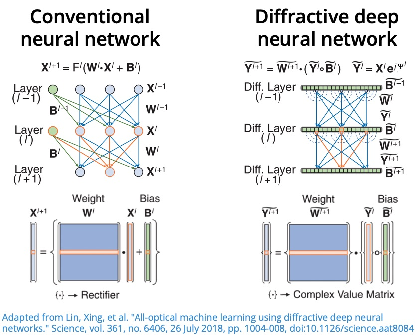
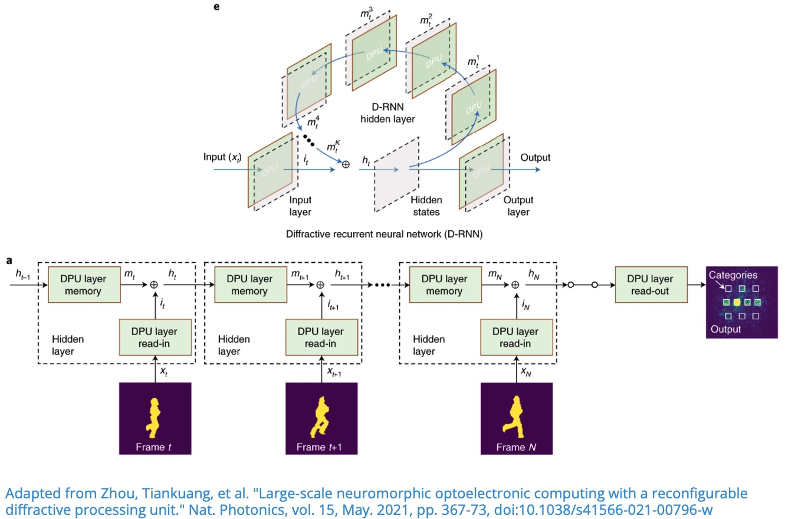
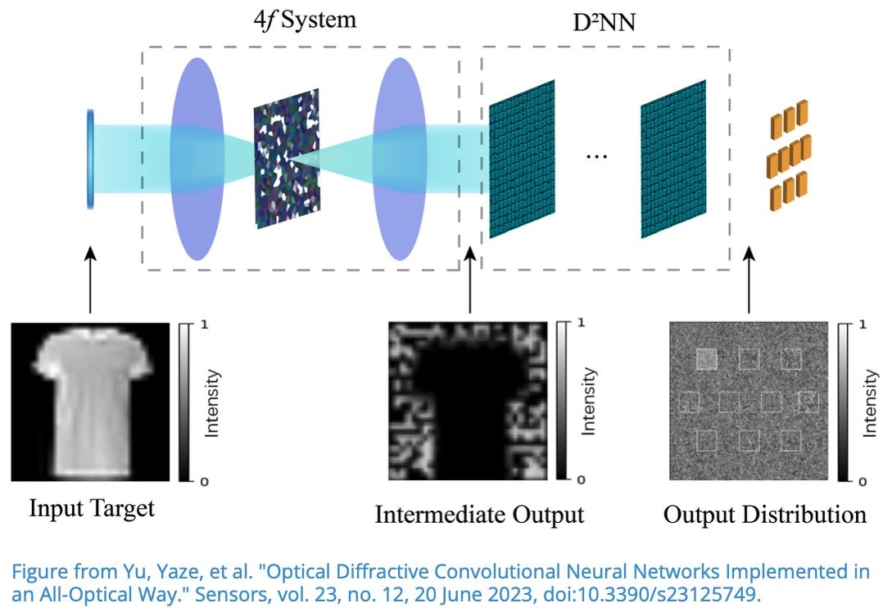

import { TrackBadges } from '../TrackBadges'
import { Comments } from '../Comments'

# Linear Diffractive Neural Network

<TrackBadges slug="optical-computing" />

One of the most influential papers on diffractive deep neural networks (D2NNs) is
"All-optical machine learning using diffractive deep neural networks" [[1]](https://www.science.org/doi/10.1126/science.aat8084).

In this lecture, we reproduce the core D2NN architecture from [[1]](https://www.science.org/doi/10.1126/science.aat8084) in SVETlANNa and train it on MNIST using the same physical design principles.
The goal is to understand how a conventional neural-network operation can be mapped
to optical propagation and phase modulation.

# Theory

## From conventional neural networks to optical layers

For a classical neural network, the output of layer $l$ is
$$
\vec{X}^{l+1} = F^l(\hat{W}^{l} \vec{X}^l + \vec{B}^l),
$$
where:

- $\hat{W}^l$ is the weight matrix,
- $\vec{B}^l$ is the bias vector,
- $F^l$ is a nonlinear activation function.

Stacking layers gives a composition of linear transformations and nonlinearities.

In a D2NN, the trainable part is implemented by diffractive phase masks,
and layer-to-layer coupling is performed by free-space propagation.
At each optical layer:

1. The complex field is multiplied by a phase mask.
1. The modulated field propagates to the next plane.

This can be written as
$$
\vec{Y}^{l+1} = \hat{W}^l * \left(e^{i\phi^l} \odot \vec{Y}^l\right),
$$
where:

- $\vec{Y}^l$ is the complex optical field at layer $l$,
- $e^{i\phi^l}$ is the phase-only modulation at layer $l$,
- $\hat{W}^l$ is the free-space propagation operator,
- $*$ denotes convolution induced by propagation,
- $\odot$ denotes element-wise multiplication.

Therefore, the trainable parameters are the phase values $\phi^l$ of each diffractive layer.

# Implementation Plan

To implement the D2NN from [[1]](https://www.science.org/doi/10.1126/science.aat8084), we will follow this workflow:

1. Define physical and simulation parameters (wavelength, layer resolution, neuron size, axial distances).
1. Prepare MNIST and encode each image as an input optical field.
1. Build the optical model in SVETlANNa:
    - define detector regions at the output plane (one region per class),
    - create a sequence of diffractive layers separated by free-space propagation.
1. Define the training pipeline.
1. Train, validate, and visualize the learned optical system.

# Parameters Reported in the Original Papers

Below are the key experimental and simulation settings reported by the authors.

From [[1]](https://www.science.org/doi/10.1126/science.aat8084):

- Task: MNIST digit classification ($0$ to $9$).
- Architecture: five-layer phase-only $D^2NN$.
- Dataset split used in training: $55{,}000$ training and $5{,}000$ validation samples.
- Illumination frequency: $0.4\,\text{THz}$ (continuous-wave).
- Neuron size: $400\,\mu\text{m}$.
- Axial spacing between successive layers: $3.0\,\text{cm}$.
- Detector size: $(6.4\lambda \times 6.4\lambda)$.
- Batch size: $8$.
- Optimizer: Adam.

Additional clarifications from [[2]](https://ieeexplore.ieee.org/abstract/document/8732486):

- Neuron size expressed relative to wavelength: approximately $0.53\lambda$.
- Layer dimensions: $200 \times 200 = 40{,}000$ neurons per diffractive layer.
- Detector normalization at the output plane:
$$
I_l' = \frac{I_l}{\max\{I_l\}} \times 10,
$$
where $I_l$ is the total optical intensity measured by detector $l$.
- Optimization details: Adam with learning rate $10^{-3}$.

These values define a practical baseline for reproducing the published D2NN behavior in SVETlANNa.

# Diffractive Recurrent Neural Network (D-RNN)

In this lecture, we implement the recurrent diffractive architecture proposed in
[[1]](https://www.nature.com/articles/s41566-021-00796-w) for human action recognition
on the [Weizmann dataset](https://www.wisdom.weizmann.ac.il/~vision/SpaceTimeActions.html).

The main objective is to show how temporal memory, usually handled by recurrent neural
networks, can be realized in an optical diffractive system.

# Theory

## Why recurrence is needed

For sequential inputs (for example, video frames), the prediction at time $t$ should depend
not only on the current frame $x_t$, but also on what the system has seen before.
This is the core idea behind recurrent models.

In a diffractive recurrent neural network (D-RNN), the optical layers are reused across time steps.
The model maintains a hidden optical state $h_t$ that combines:
- memory from the previous state $h_{t-1}$,
- information from the current input $x_t$.

The recurrence is written as
$$
h_t = \lambda f_1(h_{t-1}) + (1-\lambda)f_2(x_t),
$$
where:
- $f_1$ is the memory mapping,
- $f_2$ is the input (read-in) mapping,
- $\lambda \in (0,1)$ controls the memory-input tradeoff.

Before the detectors, a read-out mapping is applied:
$$
y = f_3(h_t).
$$

In our optical implementation, $f_1$, $f_2$, and $f_3$ are realized using diffractive layers
and free-space propagation.

For three time steps, the computation is:
$$
h_0 = f_2(x_0),
$$
$$
h_1 = \lambda f_1(h_0) + (1-\lambda)f_2(x_1),
$$
$$
h_2 = \lambda f_1(h_1) + (1-\lambda)f_2(x_2),
$$
$$
y = f_3(h_2).
$$

# Implementation Plan

To implement the D-RNN from [[1]](https://www.nature.com/articles/s41566-021-00796-w), we follow this workflow:

1. Define physical and simulation parameters (wavelength, grid size, neuron size, propagation distances).
1. Prepare the Weizmann dataset and convert videos into short frame sequences.
1. Build the optical model in SVETlANNa:
     - define detector regions at the output plane (one region per class),
     - implement read-in, memory, and read-out diffractive mappings.
1. Define the training pipeline for sequence-wise forward passes and loss computation.
1. Train, validate, and visualize classification performance and optical fields.

# Parameters Reported in the Original Paper

Key settings reported by the authors in [[1]](https://www.nature.com/articles/s41566-021-00796-w):

- Input masks were extracted by background subtraction; provided mask data include both original and aligned masks.
- Mask resolution: $64 \times 64$.
- Data split: six subjects ($60$ videos) for training and three subjects ($30$ videos) for testing.
- Sequence construction: each video is split into sub-sequences of three frames with a frame interval of two.
- Number of detector regions equals number of classes:
    - ten regions for MNIST, Fashion-MNIST, and Weizmann,
    - six regions for KTH,
    - each output region has width $0.46\,\text{mm}$.
- Recurrent state update:
$$
h_t = \lambda f_1(h_{t-1}) + (1-\lambda)f_2(x_t),
$$
with $m_t=f_1(h_{t-1})$ as the memory mapping, $i_t=f_2(x_t)$ as the input mapping,
and $\lambda \in (0,1)$ controlling the relative contribution of memory and current input.

These settings provide a practical baseline for reproducing D-RNN experiments in SVETlANNa.

# Convolutional Diffractive Network

In this lecture, we implement the Convolutional Diffractive Network introduced in
"Optical Diffractive Convolutional Neural Networks Implemented in an All-Optical Way"
[[1]](https://www.mdpi.com/1424-8220/23/12/5749).

The key idea is to perform the convolution operation optically with a 4f system,
and then feed the result into a trainable diffractive network for classification.

# Theory

Convolution in the spatial domain is equivalent to multiplication in the Fourier domain:
$$
f * g = \mathcal{F}^{-1}\left(\mathcal{F}(f)\cdot\mathcal{F}(g)\right),
$$
where $\mathcal{F}$ denotes the Fourier transform.

This identity is especially useful in optics because a lens can perform a Fourier transform.
In a 4f optical setup:
1. The first lens transforms the input field $g$ into $\mathcal{F}(g)$.
1. A filter in the Fourier plane applies multiplication by $\mathcal{F}(f)$.
1. The second lens performs the inverse transform, producing the convolution result.

So the optical system computes:
$$
f * g = \mathcal{F}^{-1}\left(\mathcal{F}(f)\cdot\mathcal{F}(g)\right).
$$

In this lecture, the Fourier-plane diffractive mask that defines the convolution kernel is fixed.
The output of the 4f convolutional stage is then propagated through a trainable diffractive
deep neural network (D2NN), which learns the final classification mapping.

# Implementation Plan

To implement the convolutional diffractive architecture from
[[1]](https://www.mdpi.com/1424-8220/23/12/5749), we follow this workflow:

1. Define physical and simulation parameters (wavelength, layer resolution, neuron size, axial distances).
1. Prepare MNIST and encode each image as an input optical field.
1. Build the optical model in SVETlANNa:
   - define detector regions at the output plane (one region per class),
   - define fixed convolution kernels in the Fourier plane,
   - create a 4f system to perform optical convolution,
   - add trainable diffractive layers with free-space propagation.
1. Define the training pipeline (forward propagation, detector readout, loss, optimization).
1. Train, validate, and visualize the learned optical system.

# Parameters Used in This Lecture

Paper [[1]](https://www.mdpi.com/1424-8220/23/12/5749) does not provide all low-level
physical parameters needed for a full implementation. For reproducibility in SVETlANNa,
we reuse compatible physical settings from [[2]](https://ieeexplore.ieee.org/abstract/document/8732486),
as in previous lectures.

One important preprocessing detail is:
- the input image of size $28 \times 28$ is zero-padded to $200 \times 200$.

<Comments />
