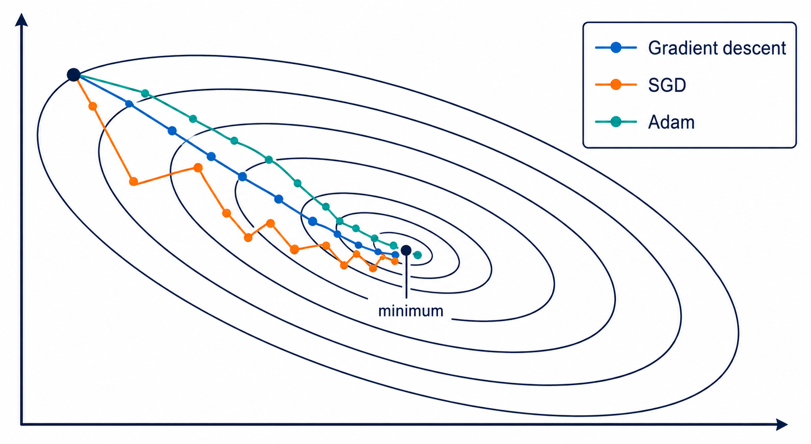

import { TrackBadges } from '../TrackBadges'
import { Comments } from '../Comments'

# Optimization methods

<TrackBadges slug="optimization-methods" />

In this lecture, we discuss optimization methods used to update weights in neural networks. There are several classes of optimization methods, but the most common ones are based on gradient descent. Popular methods such as Adam, RMSProp, and SGD with momentum calculate the gradient of the loss function with respect to the weights and then update the weights in the direction opposite to the gradient. Other methods, such as Newton's method and quasi-Newton methods, use second-order derivatives of the loss function. These methods can converge faster than gradient descent, but they are also more computationally expensive because they require calculation of the Hessian matrix. In practice, these methods are not commonly used to train neural networks because they can be very slow and require a lot of memory. Instead, most practitioners use gradient-based optimization methods, which are more efficient and can still achieve good results.

*Gradient descent, SGD, and Adam follow different trajectories toward a minimum of the same loss function.*

## Problem formulation

The unconstrained optimization problem can be formulated as follows. Consider the loss function $\boldsymbol{E}(\boldsymbol{w})$, where $\boldsymbol{w}$ is the vector of weights. The goal is to find the weights $\boldsymbol{w}^*$ that minimize the loss function, i.e.,
$$
\boldsymbol{w}^* = \arg\min_{\boldsymbol{w}} \boldsymbol{E}(\boldsymbol{w}).
$$

At a local minimum of the loss function, the following conditions must be satisfied:
$$
\nabla \boldsymbol{E}(\boldsymbol{w}^*) = \boldsymbol{0}, \qquad \nabla^2 \boldsymbol{E}(\boldsymbol{w}^*) \succ 0.
$$
Here,
$$
\nabla = \left( \frac{\partial}{\partial w_1}, \frac{\partial}{\partial w_2}, \ldots, \frac{\partial}{\partial w_n} \right)^T
$$
and
$$
\nabla \boldsymbol{E}(\boldsymbol{w}) = \left( \frac{\partial \boldsymbol{E}}{\partial w_1}, \frac{\partial \boldsymbol{E}}{\partial w_2}, \ldots, \frac{\partial \boldsymbol{E}}{\partial w_n} \right)^T
$$
The most common optimization methods are based on iterative descent, which means that we start with an initial guess for the weights and then iteratively update them in the direction opposite to the gradient until we reach a local minimum. We assume that the loss function decreases at each iteration, i.e., $\boldsymbol{E}(\boldsymbol{w}_{n+1}) < \boldsymbol{E}(\boldsymbol{w}_n)$.

## Gradient descent
The most basic optimization method is gradient descent, which updates the weights as follows:
$$
\boldsymbol{w}_{n+1} = \boldsymbol{w}_n - \eta \boldsymbol{g}_n,
$$
where $\eta$ is the learning rate and $\boldsymbol{g}_n = \nabla \boldsymbol{E}(\boldsymbol{w}_n)$ is the gradient of the loss function with respect to the weights at iteration $n$. The learning rate controls how much we update the weights in each iteration. If the learning rate is too small, the optimization process will be slow and may get stuck in a local minimum. If the learning rate is too large, the optimization process may diverge and fail to find a minimum.

Let us show that the loss function decreases at the next iteration, i.e., $\boldsymbol{E}(\boldsymbol{w}_{n+1}) < \boldsymbol{E}(\boldsymbol{w}_n)$. We can use the Taylor expansion of the loss function around $\boldsymbol{w}_n$:
$$
\boldsymbol{E}(\boldsymbol{w}_{n+1}) \approx \boldsymbol{E}(\boldsymbol{w}_n) - \eta \boldsymbol{g}_n^T \boldsymbol{g}_n = \boldsymbol{E}(\boldsymbol{w}_n) - \eta \|\boldsymbol{g}_n\|^2 < \boldsymbol{E}(\boldsymbol{w}_n)
$$
Consequently, the loss function will decrease in each iteration as long as the learning rate is positive and small and the gradient is not zero. However, gradient descent can be slow to converge, especially for large and complex neural networks. Therefore, several variants of gradient descent have been developed to improve convergence speed and stability.

## Adam — Adaptive Moment Estimation

Adam is a stochastic optimization method that combines an exponential moving average of gradients (the first moment) with an exponential moving average of squared gradients (the second moment).

The classic Adam method includes several parameters:

- $\alpha$ — learning rate;
- $\beta_1$ — exponential decay rate for the first-moment estimates (usually set to 0.9);
- $\beta_2$ — exponential decay rate for the second-moment estimates (usually set to 0.999);
- $\varepsilon$ — a small constant for numerical stability (usually set to $10^{-8}$).

Let us consider the transition from iteration $n$ to iteration $n+1$. First, we compute the gradient of the loss function with respect to the weights:
$$
\boldsymbol{g}_n = \nabla \boldsymbol{E}(\boldsymbol{w}_n)
$$

Second, we update the biased first- and second-moment estimates as follows:
$$
\boldsymbol{m}_n = \beta_1 \boldsymbol{m}_{n-1} + (1 - \beta_1) \boldsymbol{g}_n
$$
$$
\boldsymbol{v}_n = \beta_2 \boldsymbol{v}_{n-1} + (1 - \beta_2) \boldsymbol{g}_n^2
$$
Third, we compute the bias-corrected first- and second-moment estimates as follows:
$$
\hat{\boldsymbol{m}}_n = \frac{\boldsymbol{m}_n}{1 - \beta_1^n}
$$
$$
\hat{\boldsymbol{v}}_n = \frac{\boldsymbol{v}_n}{1 - \beta_2^n}
$$
Finally, we update the weights as follows:
$$
\boldsymbol{w}_{n+1} = \boldsymbol{w}_n - \alpha \frac{\hat{\boldsymbol{m}}_n}{\sqrt{\hat{\boldsymbol{v}}_n} + \varepsilon}
$$

The advantage of Adam is that it can adapt the learning rate for each weight based on the historical gradients, which can lead to faster convergence and better performance. However, Adam can also be sensitive to the choice of hyperparameters and may not always converge to the optimal solution. Therefore, it is important to carefully tune the hyperparameters when using Adam for training neural networks.

## Stochastic Gradient Descent

Another popular optimization method is stochastic gradient descent (SGD), which updates the weights using a randomly selected subset of the training data called a mini-batch. The update rule for SGD is similar to that of gradient descent, but it uses the average gradient computed over the mini-batch instead of the full dataset.

Let us consider the transition from iteration $n$ to iteration $n+1$ for SGD. First, we randomly select a mini-batch of training data and compute the average gradient of the loss function with respect to the weights over the mini-batch:
$$
\boldsymbol{g}_n = \frac{1}{m} \sum_{i=1}^m \nabla \boldsymbol{E}(\boldsymbol{w}_n; x_i, y_i)
$$
where $m$ is the size of the mini-batch and $(x_i, y_i)$ are the training examples in the mini-batch.

Second, we update the weights as follows:
$$
\boldsymbol{w}_{n+1} = \boldsymbol{w}_n - \alpha \boldsymbol{g}_n
$$
Third, we move to the next mini-batch and repeat the process until we have gone through the entire dataset. This process is called an epoch. SGD can be more efficient when training large neural networks on large datasets, but it can also be more sensitive to the choice of hyperparameters and may require more careful tuning to achieve good performance.

## References

- Simon Haykin, *Neural Networks and Learning Machines*, 3rd ed., Pearson, 2009.
- Diederik P. Kingma and Jimmy Ba, “Adam: A Method for Stochastic Optimization,” *International Conference on Learning Representations (ICLR)*, 2015.
- Léon Bottou, Frank E. Curtis, and Jorge Nocedal, “Optimization Methods for Large-Scale Machine Learning,” *SIAM Review* 60(2), 223–311, 2018.

<Comments />
