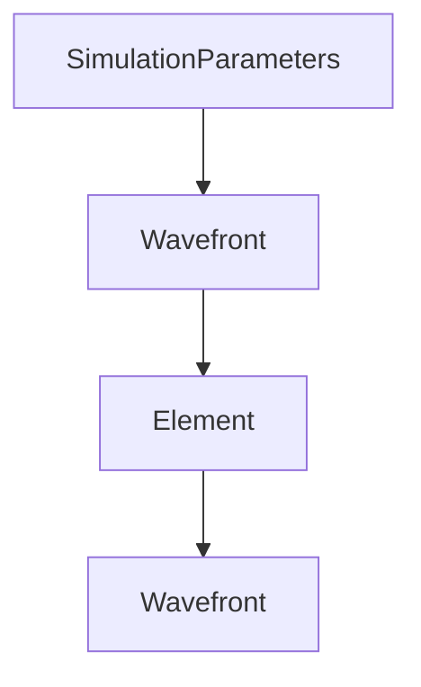

# Основные концепции

import { Callout, Cards } from 'nextra/components'

## Архитектура библиотеки

SVETlANNa построена на четырёх ключевых компонентах:



---

## SimulationParameters

`SimulationParameters` определяет координатную систему симуляции и хранит все оси.

### Создание

```python
from svetlanna import SimulationParameters
from svetlanna.units import ureg

# Рекомендуемый способ
params = SimulationParameters.from_ranges(
    w_range=(-1*ureg.mm, 1*ureg.mm), w_points=512,  # Ось X (W)
    h_range=(-1*ureg.mm, 1*ureg.mm), h_points=512,  # Ось Y (H)
    wavelength=632.8*ureg.nm                         # Длина волны
)

# Альтернативный способ — из тензоров
import torch
params = SimulationParameters(
    W=torch.linspace(-1e-3, 1e-3, 512),
    H=torch.linspace(-1e-3, 1e-3, 512),
    wavelength=torch.tensor(632.8e-9)
)
```

### Доступ к осям

```python
# Через атрибут axes
x = params.axes.W           # 1D тензор координат X
y = params.axes.H           # 1D тензор координат Y
wl = params.axes.wavelength # Длина волны

# Или напрямую
x = params.W
y = params.H

# Создание 2D сетки
X, Y = params.meshgrid(x_axis='W', y_axis='H')
```

### Дополнительные оси

<Callout type="info">
`SimulationParameters` по умолчанию заморожен. Для добавления осей используйте `unfreeze()`.
</Callout>

```python
params.unfreeze()
params.add_axis('pol', torch.tensor([1., 0.]))  # Поляризация (Jones vector)
params.freeze()
```

---

## Wavefront

`Wavefront` — это комплексная амплитуда электромагнитного поля $E(x,y)$. Наследует `torch.Tensor`.

### Фабричные методы

```python
from svetlanna import Wavefront

# Плоская волна
wf = Wavefront.plane_wave(params)

# Гауссов пучок
wf = Wavefront.gaussian_beam(
    params,
    waist_radius=0.5*ureg.mm,
    distance=0.0,          # Расстояние от перетяжки
    dx=0.0, dy=0.0         # Смещение центра
)

# Сферическая волна
wf = Wavefront.spherical_wave(
    params,
    distance=100*ureg.mm   # Радиус кривизны
)
```

### Свойства

| Свойство | Описание | Формула |
|----------|----------|---------|
| `wf.intensity` | Интенсивность | $I = \|E\|^2$ |
| `wf.phase` | Фаза | $\phi = \arg(E)$ |
| `wf.max_intensity` | Максимум интенсивности | $\max(I)$ |
| `wf.fwhm(params)` | FWHM по X и Y | — |

### Операции

```python
# Wavefront наследует torch.Tensor
wf_sum = wf1 + wf2        # Интерференция
wf_scaled = wf * 0.5      # Масштабирование
wf_gpu = wf.to("cuda")    # Перенос на GPU
wf_conj = wf.conj()       # Комплексное сопряжение
```

---

## Element

Все оптические элементы наследуют `torch.nn.Module` и реализуют метод `forward()`.

```python
from svetlanna.elements import ThinLens, FreeSpace, RoundAperture

# Создание элемента
lens = ThinLens(params, focal_length=100*ureg.mm)

# Применение к волновому фронту
wf_out = lens(wf_in)

# Или явно через forward
wf_out = lens.forward(wf_in)
```

### Основные элементы

| Элемент | Описание | Ключевые параметры |
|---------|----------|-------------------|
| `FreeSpace` | Распространение в свободном пространстве | `distance`, `method` |
| `ThinLens` | Тонкая линза | `focal_length`, `radius` |
| `RoundAperture` | Круглая апертура | `radius` |
| `RectangularAperture` | Прямоугольная апертура | `width`, `height` |
| `Aperture` | Произвольная маска | `mask` |
| `SpatialLightModulator` | SLM | `mask`, `height`, `width` |
| `DiffractiveLayer` | Дифракционный слой | `mask`, `mask_norm` |
| `NonlinearElement` | Нелинейный элемент | `response_function` |

<Callout type="warning">
`FreeSpace` требует обязательный параметр `method`: `'AS'` (Angular Spectrum) или `'fresnel'`.
</Callout>

---

## LinearOpticalSetup

`LinearOpticalSetup` объединяет элементы в последовательную оптическую систему.

```python
from svetlanna import LinearOpticalSetup

setup = LinearOpticalSetup([
    RoundAperture(params, radius=1*ureg.mm),
    FreeSpace(params, distance=50*ureg.mm, method='AS'),
    ThinLens(params, focal_length=100*ureg.mm),
    FreeSpace(params, distance=100*ureg.mm, method='AS'),
])

# Forward pass
wf_out = setup(wf_in)

# Пошаговое распространение (возвращает все промежуточные результаты)
intermediates = setup.stepwise_forward(wf_in)
```

---

## Единицы измерения

Модуль `svetlanna.units` предоставляет систему единиц через enum `ureg`:

```python
from svetlanna.units import ureg

# Расстояния
1*ureg.m    # 1.0
1*ureg.cm   # 0.01
1*ureg.mm   # 0.001
1*ureg.um   # 1e-6
1*ureg.nm   # 1e-9
1*ureg.pm   # 1e-12

# Время
1*ureg.s    # 1.0
1*ureg.ms   # 0.001
1*ureg.us   # 1e-6
1*ureg.ns   # 1e-9
1*ureg.fs   # 1e-15

# Частота
1*ureg.Hz   # 1.0
1*ureg.kHz  # 1e3
1*ureg.MHz  # 1e6
1*ureg.GHz  # 1e9
```

---

## Дифференцируемость

Все операции в SVETlANNa дифференцируемы через PyTorch autograd:

```python
import torch

# Оптимизируемый параметр
phase_mask = torch.nn.Parameter(torch.zeros(512, 512))

# Forward pass
wf_out = element(wf_in)
loss = some_loss_function(wf_out)

# Backward pass
loss.backward()
print(phase_mask.grad)  # Градиенты!
```

---

## Несколько длин волн

SVETlANNa поддерживает многомерные расчёты:

```python
# Несколько длин волн (RGB)
params = SimulationParameters(
    W=torch.linspace(-1e-3, 1e-3, 256),
    H=torch.linspace(-1e-3, 1e-3, 256),
    wavelength=torch.tensor([630, 532, 465]) * 1e-9
)

wf = Wavefront.gaussian_beam(params, waist_radius=0.3e-3)
print(wf.shape)  # torch.Size([3, 256, 256]) — три длины волны!
```

---

## Что дальше?

<Cards>
  <Cards.Card title="SimulationParameters" href="/docs/guides/simulation-parameters" />
  <Cards.Card title="Волновые фронты" href="/docs/guides/wavefronts" />
  <Cards.Card title="Оптические элементы" href="/docs/guides/elements" />
  <Cards.Card title="Детекторы" href="/docs/guides/detector" />
</Cards>
