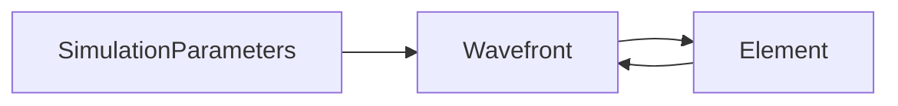

# Core concepts

import { Callout, Cards } from 'nextra/components'

## Architecture

SVETlANNa is built around four key components:


```mermaid
flowchart LR
    A[SimulationParameters] --> B[Wavefront]
    B --> C[Element]
    C --> B
```

---

## SimulationParameters

`SimulationParameters` defines the coordinate system of the simulation and stores all axes.

### Creating it

```python
from svetlanna import SimulationParameters
from svetlanna.units import ureg

# recommended
params = SimulationParameters.from_ranges(
    x_range=(-1*ureg.mm, 1*ureg.mm), x_points=512,  # X axis
    y_range=(-1*ureg.mm, 1*ureg.mm), y_points=512,  # Y axis
    wavelength=632.8*ureg.nm                        # wavelength
)

# alternatively, straight from tensors
import torch
params = SimulationParameters(
    x=torch.linspace(-1e-3, 1e-3, 512),
    y=torch.linspace(-1e-3, 1e-3, 512),
    wavelength=torch.tensor(632.8e-9)
)
```

### Accessing the axes

```python
x = params.x            # 1D tensor of X coordinates
y = params.y            # 1D tensor of Y coordinates
wl = params.wavelength  # wavelength

# or by name
x = params['x']

# names of all axes, in tensor order
print(params.axis_names)   # ('y', 'x')

# 2D coordinate grids
X, Y = params.meshgrid(x_axis='x', y_axis='y')
```

### Additional axes

Any keyword passed to the constructor becomes an axis, so extra dimensions — polarisation,
time, an ensemble index — are declared at construction time:

```python
params = SimulationParameters(
    x=torch.linspace(-1e-3, 1e-3, 256),
    y=torch.linspace(-1e-3, 1e-3, 256),
    wavelength=torch.tensor(632.8e-9),
    pol=torch.tensor([1., 0.]),   # extra axis
)
```

---

## Wavefront

`Wavefront` is the complex amplitude of the electromagnetic field $E(x,y)$. It subclasses
`torch.Tensor`.

### Factory methods

```python
from svetlanna import Wavefront

# plane wave
wf = Wavefront.plane_wave(params)

# Gaussian beam
wf = Wavefront.gaussian_beam(
    params,
    waist_radius=0.5*ureg.mm,
    distance=0.0,          # distance from the waist
    dx=0.0, dy=0.0         # offset of the centre
)

# spherical wave
wf = Wavefront.spherical_wave(
    params,
    distance=100*ureg.mm   # distance from the point source
)

# Hermite–Gaussian mode
wf = Wavefront.hermite_gauss(
    params, waist_radius=0.5*ureg.mm, m=1, n=0
)
```

### Properties

| Property | Description | Formula |
|----------|-------------|---------|
| `wf.intensity` | Intensity | $I = \|E\|^2$ |
| `wf.phase` | Phase | $\phi = \arg(E)$ |
| `wf.max_intensity` | Peak intensity | $\max(I)$ |
| `wf.fwhm(params)` | FWHM along X and Y | — |

### Operations

```python
# Wavefront inherits torch.Tensor
wf_sum = wf1 + wf2        # interference
wf_scaled = wf * 0.5      # attenuation
wf_gpu = wf.to("cuda")    # move to the GPU
wf_conj = wf.conj()       # complex conjugate
```

---

## Element

Every optical element subclasses `torch.nn.Module` and implements `forward()`.

```python
from svetlanna.elements import ThinLens, FreeSpace, RoundAperture

lens = ThinLens(params, focal_length=100*ureg.mm)

# apply it to a wavefront
wf_out = lens(wf_in)
```

### The main elements

| Element | Description | Key parameters |
|---------|-------------|----------------|
| `FreeSpace` | Free-space propagation | `distance`, `method` |
| `ThinLens` | Thin lens | `focal_length`, `radius` |
| `RoundAperture` | Circular aperture | `radius` |
| `RectangularAperture` | Rectangular aperture | `width`, `height` |
| `Aperture` | Arbitrary mask | `mask` |
| `SpatialLightModulator` | SLM | `mask`, `height`, `width`, `lut_function` |
| `DiffractiveLayer` | Diffractive layer | `mask`, `mask_norm` |
| `NonlinearElement` | Nonlinear element | `response_function` |

<Callout type="warning">
`FreeSpace` requires `method`: `'ASM'`, `'zpASM'`, `'RSC'` or `'zpRSC'`.
</Callout>

---

## LinearOpticalSetup

`LinearOpticalSetup` chains elements into a sequential optical system.

```python
from svetlanna import LinearOpticalSetup

setup = LinearOpticalSetup([
    RoundAperture(params, radius=1*ureg.mm),
    FreeSpace(params, distance=50*ureg.mm, method='zpASM'),
    ThinLens(params, focal_length=100*ureg.mm),
    FreeSpace(params, distance=100*ureg.mm, method='zpASM'),
])

# forward pass
wf_out = setup(wf_in)

# step-by-step propagation (returns every intermediate field)
intermediates = setup.stepwise_forward(wf_in)
```

---

## Units

The `svetlanna.units` module provides a unit registry through the `ureg` enum:

```python
from svetlanna.units import ureg

# length
1*ureg.m    # 1.0
1*ureg.cm   # 0.01
1*ureg.mm   # 0.001
1*ureg.um   # 1e-6
1*ureg.nm   # 1e-9
1*ureg.pm   # 1e-12

# time
1*ureg.s    # 1.0
1*ureg.ms   # 0.001
1*ureg.us   # 1e-6
1*ureg.ns   # 1e-9
1*ureg.fs   # 1e-15

# frequency
1*ureg.Hz   # 1.0
1*ureg.kHz  # 1e3
1*ureg.MHz  # 1e6
1*ureg.GHz  # 1e9
```

Multiplying by a unit yields a plain `float` in SI units, so the values interoperate with
anything that expects metres or seconds.

---

## Differentiability

Every operation in SVETlANNa is differentiable through PyTorch autograd:

```python
import torch

# an optimisable parameter
phase_mask = torch.nn.Parameter(torch.zeros(512, 512))

# forward pass
wf_out = element(wf_in)
loss = some_loss_function(wf_out)

# backward pass
loss.backward()
print(phase_mask.grad)  # gradients!
```

---

## Multiple wavelengths

SVETlANNa handles extra axes natively:

```python
# three wavelengths (RGB)
params = SimulationParameters(
    x=torch.linspace(-1e-3, 1e-3, 256),
    y=torch.linspace(-1e-3, 1e-3, 256),
    wavelength=torch.tensor([630, 532, 465]) * 1e-9
)

wf = Wavefront.gaussian_beam(params, waist_radius=0.3e-3)
print(wf.shape)  # torch.Size([3, 256, 256]) — three wavelengths
```

---

## What next?

<Cards>
  <Cards.Card title="SimulationParameters" href="/docs/guides/simulation-parameters" />
  <Cards.Card title="Wavefronts" href="/docs/guides/wavefronts" />
  <Cards.Card title="Optical elements" href="/docs/guides/elements" />
  <Cards.Card title="Detectors" href="/docs/guides/detector" />
</Cards>
