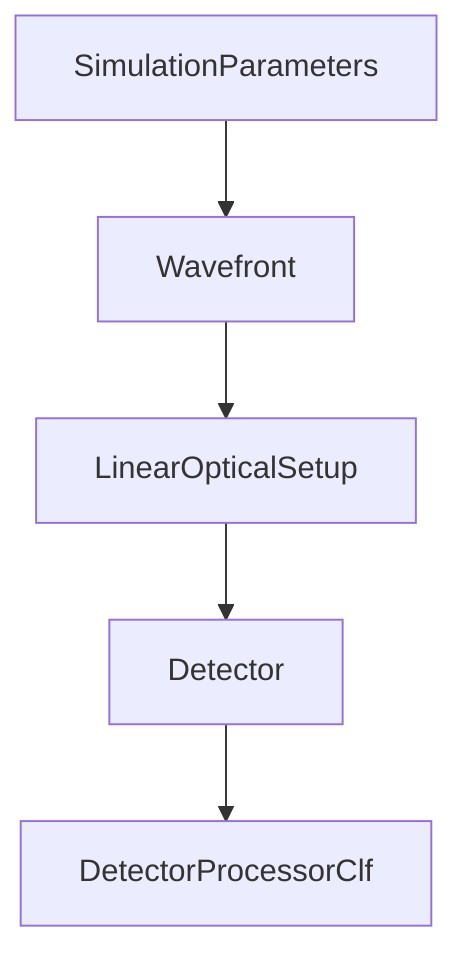

# SVETlANNa

import { Cards, Callout } from 'nextra/components'

**SVETlANNa** (Simulating Various Elements of Tunable LAser Neural Networks Accurately) — библиотека для моделирования оптических систем и дифракционных нейронных сетей на базе PyTorch.

<Callout type="info">
**Версия 1.0.4** — полная поддержка дифференцируемого моделирования, GPU-ускорение и интеграция с экосистемой PyTorch.
</Callout>

## Возможности

| Функция | Описание |
|---------|----------|
| **Дифференцируемое моделирование** | Полная интеграция с PyTorch autograd для оптимизации |
| **Методы распространения** | Angular Spectrum (AS) и приближение Френеля |
| **Оптические элементы** | Линзы, апертуры, SLM, дифракционные слои, нелинейные элементы |
| **Волновые фронты** | Плоские, гауссовы, сферические волны |
| **Нейронные сети** | LinearOpticalSetup, DiffractiveConv, DiffractiveRNN |
| **Детекторы** | Detector и DetectorProcessorClf для классификации |
| **GPU ускорение** | Нативная поддержка CUDA |

## Быстрый старт

```python
from svetlanna import SimulationParameters, Wavefront, LinearOpticalSetup
from svetlanna.elements import ThinLens, FreeSpace, DiffractiveLayer
from svetlanna.units import ureg

# Параметры симуляции
params = SimulationParameters.from_ranges(
    w_range=(-1*ureg.mm, 1*ureg.mm), w_points=512,
    h_range=(-1*ureg.mm, 1*ureg.mm), h_points=512,
    wavelength=632.8*ureg.nm
)

# Гауссов пучок
wf = Wavefront.gaussian_beam(params, waist_radius=0.3*ureg.mm)

# Оптическая система
setup = LinearOpticalSetup([
    ThinLens(params, focal_length=50*ureg.mm),
    FreeSpace(params, distance=50*ureg.mm, method='AS'),
])

# Фокусировка
wf_focus = setup(wf)
print(f"Интенсивность в фокусе: {wf_focus.max_intensity:.2e}")
```

## Структура документации

<Cards>
  <Cards.Card title="Начало работы" href="/docs/getting-started" />
  <Cards.Card title="Руководства" href="/docs/guides" />
  <Cards.Card title="Туториалы" href="/docs/tutorials" />
  <Cards.Card title="API Reference" href="/docs/api" />
</Cards>

## Архитектура



## Ссылки

- [GitHub](https://github.com/CompPhysLab/SVETlANNa)
- [PyPI](https://pypi.org/project/svetlanna/)
