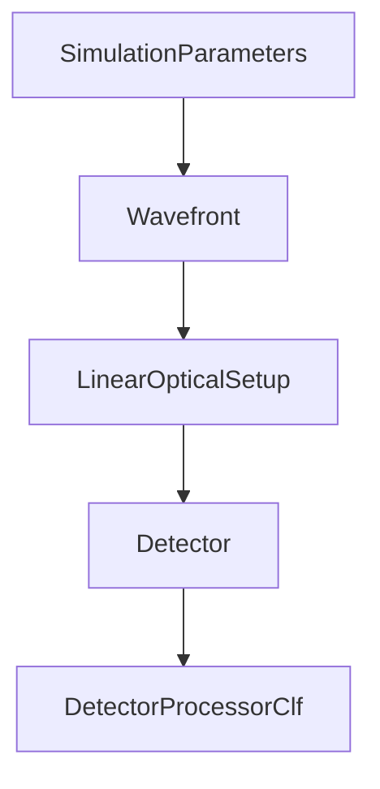

# SVETlANNa

import { Cards, Callout } from 'nextra/components'

**SVETlANNa** (Simulating Various Elements of Tunable LAser Neural Networks Accurately) is a
PyTorch-based library for simulating optical systems and diffractive neural networks.

<Callout type="info">
**Version 2.0.2** — fully differentiable simulation, GPU acceleration, and native
integration with the PyTorch ecosystem.
</Callout>

## Features

| Feature | Description |
|---------|-------------|
| **Differentiable simulation** | Full PyTorch autograd integration for optimisation |
| **Propagation methods** | Angular spectrum (ASM) and Rayleigh–Sommerfeld convolution (RSC), each with a zero-padded variant |
| **Optical elements** | Lenses, apertures, SLMs, diffractive layers, nonlinear elements |
| **Wavefronts** | Plane, Gaussian, spherical and Hermite–Gaussian fields |
| **Neural networks** | `LinearOpticalSetup`, `DiffractiveRNN`, `ConvDiffNetwork4F`, `LinearAutoencoder` |
| **Detectors** | `Detector` and `DetectorProcessorClf` for classification |
| **GPU acceleration** | Native CUDA support |

## Quickstart

```python
from svetlanna import SimulationParameters, Wavefront, LinearOpticalSetup
from svetlanna.elements import ThinLens, FreeSpace
from svetlanna.units import ureg

# simulation parameters
params = SimulationParameters.from_ranges(
    x_range=(-1*ureg.mm, 1*ureg.mm), x_points=512,
    y_range=(-1*ureg.mm, 1*ureg.mm), y_points=512,
    wavelength=632.8*ureg.nm
)

# a Gaussian beam
wf = Wavefront.gaussian_beam(params, waist_radius=0.3*ureg.mm)

# an optical system
setup = LinearOpticalSetup([
    ThinLens(params, focal_length=50*ureg.mm),
    FreeSpace(params, distance=50*ureg.mm, method='zpASM'),
])

# focusing
wf_focus = setup(wf)
print(f"Intensity in the focus: {wf_focus.max_intensity:.2e}")
```

## Documentation map

<Cards>
  <Cards.Card title="Getting started" href="/docs/getting-started" />
  <Cards.Card title="Guides" href="/docs/guides" />
  <Cards.Card title="Tutorials" href="/docs/tutorials" />
  <Cards.Card title="API Reference" href="/docs/api" />
</Cards>

## Architecture


```mermaid
flowchart TB
    A[SimulationParameters] --> B[Wavefront]
    B --> C[LinearOpticalSetup]
    C --> D[Detector]
    D --> E[DetectorProcessorClf]
```

## Links

- [GitHub](https://github.com/CompPhysLab/SVETlANNa)
- [PyPI](https://pypi.org/project/svetlanna/)
