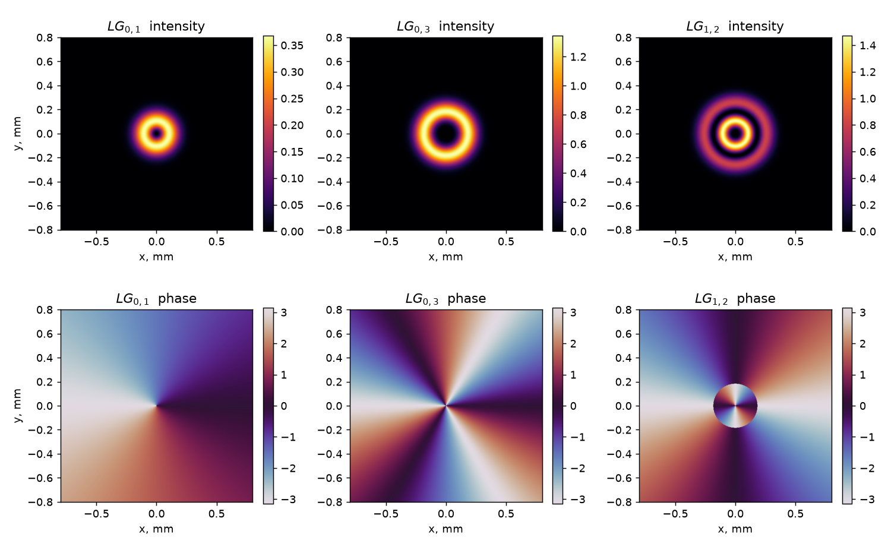
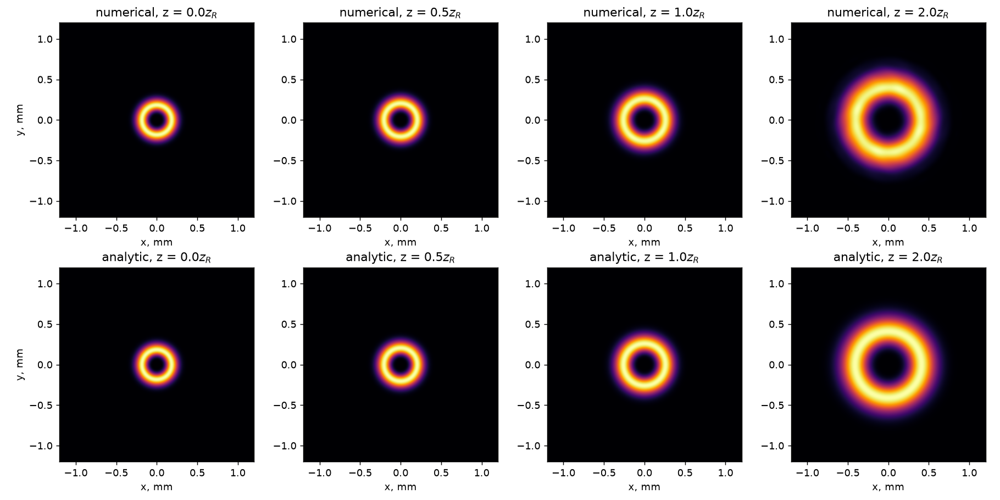
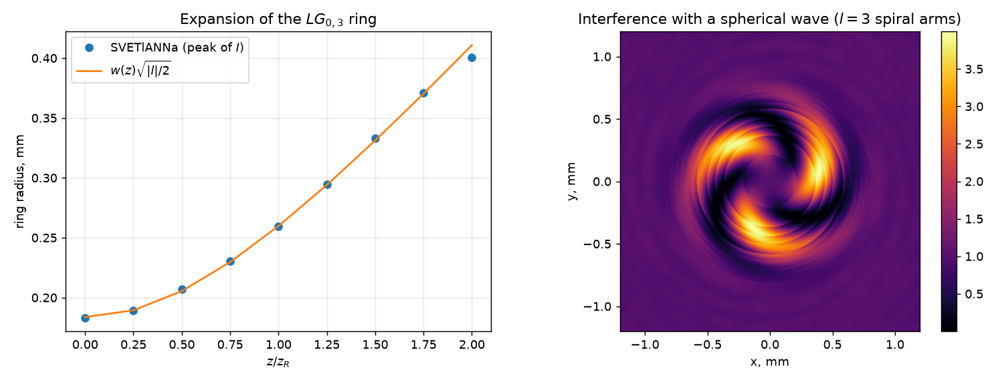

# Propagation of a Laguerre–Gaussian beam

import { Callout, Steps } from 'nextra/components'

Laguerre–Gaussian (LG) modes are the natural eigenmodes of a cylindrically symmetric
resonator. Every mode with an azimuthal index $l \neq 0$ carries an optical vortex: its
phase winds by $2\pi l$ around the axis, the intensity has a dark core, and each photon
carries $l\hbar$ of orbital angular momentum.

`Wavefront` ships with `plane_wave`, `gaussian_beam`, `spherical_wave` and `hermite_gauss`.
LG modes are not built in, so this tutorial shows how to define one on the simulation grid,
propagate it with `FreeSpace`, and verify the result against the analytical solution.

## Theory

At a distance $z$ from the waist the $LG_{p,l}$ mode is

$$
E_{p,l}(r, \varphi, z) = \frac{w_0}{w(z)}
  \left(\frac{\sqrt{2}\,r}{w(z)}\right)^{|l|}
  L_p^{|l|}\!\left(\frac{2r^2}{w(z)^2}\right)
  \exp\left(-\frac{r^2}{w(z)^2}\right)
  e^{i l \varphi}\,
  e^{i k z}\,
  e^{i k r^2 / 2R(z)}\,
  e^{-i \zeta_{p,l}(z)},
$$

with the usual Gaussian-beam quantities

$$
w(z) = w_0\sqrt{1 + (z/z_R)^2}, \quad
R(z) = z\left[1 + (z_R/z)^2\right], \quad
z_R = \frac{\pi w_0^2}{\lambda},
$$

the generalised Laguerre polynomial $L_p^{|l|}$, and the Gouy phase

$$
\zeta_{p,l}(z) = (2p + |l| + 1)\arctan(z / z_R).
$$

Two consequences are worth checking numerically:

- the beam keeps its shape and only scales with $w(z)$ — LG modes are **self-similar**;
- the bright ring of an $LG_{0,l}$ mode sits at $r = w(z)\sqrt{|l|/2}$.

## Step 1: Defining the mode

<Steps>
### Imports and grid

```python
import math
import numpy as np
import torch
import matplotlib.pyplot as plt

from svetlanna import SimulationParameters, Wavefront
from svetlanna.elements import FreeSpace
from svetlanna.units import ureg

W0 = 0.15 * ureg.mm
LAM = 632.8 * ureg.nm
Z_R = math.pi * W0 ** 2 / LAM        # Rayleigh range

params = SimulationParameters.from_ranges(
    x_range=(-1.5 * ureg.mm, 1.5 * ureg.mm), x_points=1024,
    y_range=(-1.5 * ureg.mm, 1.5 * ureg.mm), y_points=1024,
    wavelength=LAM,
)

print(f"Rayleigh range: {Z_R * 1e3:.2f} mm")
```

**Output:**
```
Rayleigh range: 111.70 mm
```

### The generalised Laguerre polynomial

A three-term upward recurrence is enough and stays differentiable:

```python
def laguerre(p: int, alpha: int, x: torch.Tensor) -> torch.Tensor:
    """Generalised Laguerre polynomial L_p^alpha(x)."""
    if p == 0:
        return torch.ones_like(x)
    l_prev, l_cur = torch.ones_like(x), 1 + alpha - x
    for n in range(1, p):
        l_prev, l_cur = l_cur, (
            (2 * n + 1 + alpha - x) * l_cur - (n + alpha) * l_prev
        ) / (n + 1)
    return l_cur
```

### The mode itself

`SimulationParameters.meshgrid` returns the coordinate grids, so the mode is written
directly in the formula of the theory section:

```python
def laguerre_gauss(sim, waist_radius, p=0, l=0, distance=0.0):
    """LG_{p,l} mode of a given waist, evaluated at `distance` from the waist."""
    x, y = sim.meshgrid(x_axis="x", y_axis="y")
    wavelength = float(sim.wavelength)
    k = 2 * math.pi / wavelength
    z_r = math.pi * waist_radius ** 2 / wavelength

    r2 = x ** 2 + y ** 2
    r = torch.sqrt(r2)
    phi = torch.atan2(y, x)

    w = waist_radius * math.sqrt(1 + (distance / z_r) ** 2)
    inv_R = distance / (distance ** 2 + z_r ** 2)      # 1 / R(z), finite at z = 0
    gouy = (2 * p + abs(l) + 1) * math.atan(distance / z_r)

    amplitude = (
        waist_radius / w
        * (math.sqrt(2) * r / w) ** abs(l)
        * laguerre(p, abs(l), 2 * r2 / w ** 2)
        * torch.exp(-r2 / w ** 2)
    )
    phase = l * phi + k * distance + k * r2 * inv_R / 2 - gouy
    return Wavefront(amplitude * torch.exp(1j * phase))
```

<Callout type="info">
`Wavefront` is a subclass of `torch.Tensor`, so wrapping a complex tensor is all it takes
to obtain a field that every element of the library accepts.
</Callout>
</Steps>

## Step 2: The mode gallery

```python
for p, l in [(0, 1), (0, 3), (1, 2)]:
    wf = laguerre_gauss(params, W0, p=p, l=l)
    plt.imshow(wf.intensity.numpy(), cmap="inferno")
    plt.imshow(wf.phase.numpy(), cmap="twilight", vmin=-math.pi, vmax=math.pi)
```



The azimuthal index $l$ sets the number of $2\pi$ phase ramps around the axis, and the
radial index $p$ adds $p$ dark rings — visible in $LG_{1,2}$ both as a gap in the intensity
and as a $\pi$ phase jump across it.

## Step 3: Propagation

`FreeSpace` propagates the field the same way it would any other wavefront:

```python
P, L = 0, 3
wf0 = laguerre_gauss(params, W0, p=P, l=L)

for z in [0.5 * Z_R, 1.0 * Z_R, 2.0 * Z_R]:
    numerical = FreeSpace(params, distance=z, method="zpASM")(wf0)
    analytic = laguerre_gauss(params, W0, p=P, l=L, distance=z)

    err = (numerical.intensity - analytic.intensity).abs().sum() / analytic.intensity.sum()
    print(f"z = {z * 1e3:7.2f} mm   relative intensity error = {err:.3%}")
```

**Output:**
```
z =   55.85 mm   relative intensity error = 0.250%
z =  111.70 mm   relative intensity error = 0.697%
z =  223.41 mm   relative intensity error = 3.589%
```



The numerically propagated field (top row) is indistinguishable from the closed-form
solution (bottom row). The error grows with distance because the expanding beam approaches
the edge of the computational window — enlarge `x_range` or increase the padding of the
propagator to push it back down.

<Callout type="warning">
`"zpASM"` (zero-padded angular spectrum) avoids the wrap-around artefacts of the plain
`"ASM"` method. For distances of many Rayleigh ranges, prefer `"zpRSC"`.
</Callout>

## Step 4: Ring expansion and the vortex charge

Two quantitative checks. First, the radius of the bright ring must follow
$w(z)\sqrt{|l|/2}$:

```python
x = params.x.numpy()
cy = 512   # index of the y = 0 row

for z in np.linspace(0, 2 * Z_R, 9):
    wfz = FreeSpace(params, distance=float(z), method="zpASM")(wf0) if z > 0 else wf0
    profile = wfz.intensity.numpy()[cy, cy:]
    radius_numeric = x[cy:][profile.argmax()]

    w = W0 * math.sqrt(1 + (z / Z_R) ** 2)
    radius_theory = w * math.sqrt(abs(L) / 2)
```

Second, interfering the propagated beam with a spherical reference wave turns the phase
winding into a visible spiral with exactly $|l|$ arms:

```python
wf_far = FreeSpace(params, distance=2 * Z_R, method="zpASM")(wf0)
reference = Wavefront.spherical_wave(params, distance=-0.6)

pattern = (wf_far / wf_far.abs().max() + reference / reference.abs().max()).intensity
```



The measured ring radii lie on the analytical curve, and the interference pattern shows
three arms for $l = 3$ — the sign of the topological charge is given by the handedness of
the spiral.

## Full code

```python
import math
import torch

from svetlanna import SimulationParameters, Wavefront
from svetlanna.elements import FreeSpace
from svetlanna.units import ureg

W0, LAM = 0.15 * ureg.mm, 632.8 * ureg.nm
Z_R = math.pi * W0 ** 2 / LAM

params = SimulationParameters.from_ranges(
    x_range=(-1.5 * ureg.mm, 1.5 * ureg.mm), x_points=1024,
    y_range=(-1.5 * ureg.mm, 1.5 * ureg.mm), y_points=1024,
    wavelength=LAM,
)


def laguerre(p, alpha, x):
    if p == 0:
        return torch.ones_like(x)
    l_prev, l_cur = torch.ones_like(x), 1 + alpha - x
    for n in range(1, p):
        l_prev, l_cur = l_cur, (
            (2 * n + 1 + alpha - x) * l_cur - (n + alpha) * l_prev
        ) / (n + 1)
    return l_cur


def laguerre_gauss(sim, waist_radius, p=0, l=0, distance=0.0):
    x, y = sim.meshgrid(x_axis="x", y_axis="y")
    wavelength = float(sim.wavelength)
    k = 2 * math.pi / wavelength
    z_r = math.pi * waist_radius ** 2 / wavelength

    r2 = x ** 2 + y ** 2
    w = waist_radius * math.sqrt(1 + (distance / z_r) ** 2)
    inv_R = distance / (distance ** 2 + z_r ** 2)
    gouy = (2 * p + abs(l) + 1) * math.atan(distance / z_r)

    amplitude = (
        waist_radius / w
        * (math.sqrt(2) * torch.sqrt(r2) / w) ** abs(l)
        * laguerre(p, abs(l), 2 * r2 / w ** 2)
        * torch.exp(-r2 / w ** 2)
    )
    phase = l * torch.atan2(y, x) + k * distance + k * r2 * inv_R / 2 - gouy
    return Wavefront(amplitude * torch.exp(1j * phase))


wf0 = laguerre_gauss(params, W0, p=0, l=3)
wfz = FreeSpace(params, distance=Z_R, method="zpASM")(wf0)

print("input  max intensity:", float(wf0.max_intensity))
print("output max intensity:", float(wfz.max_intensity))
```

## Things to try

- Add a `ThinLens` and watch the dark core survive focusing — a vortex cannot be focused away.
- Superpose $LG_{0,+l}$ and $LG_{0,-l}$ to obtain a petal-shaped mode with $2l$ lobes.
- Compare the Gouy phase of $LG_{0,3}$ with that of `Wavefront.hermite_gauss(m=3, n=0)`:
  modes with the same $2p + |l| = m + n$ share it.
- Encode the vortex on a `SpatialLightModulator` as a fork hologram and recover it in the
  first diffraction order — see the [SLM tutorial](/docs/tutorials/slm-grating).

## See also

- [Phase grating on an SLM](/docs/tutorials/slm-grating) — programmable phase masks
- [Wavefronts](/docs/guides/wavefronts) — the built-in field constructors
- [Optical elements](/docs/guides/elements) — propagation methods in detail
