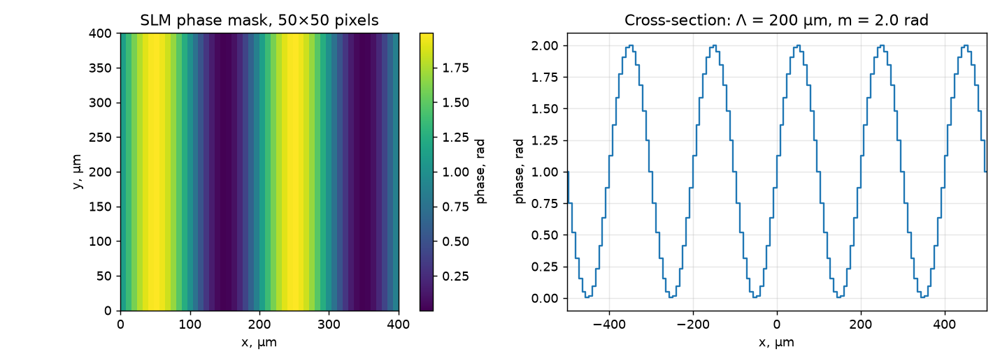
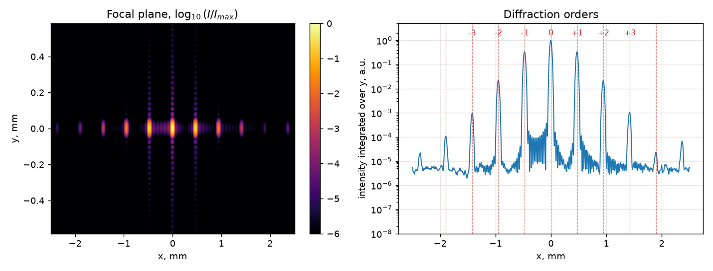
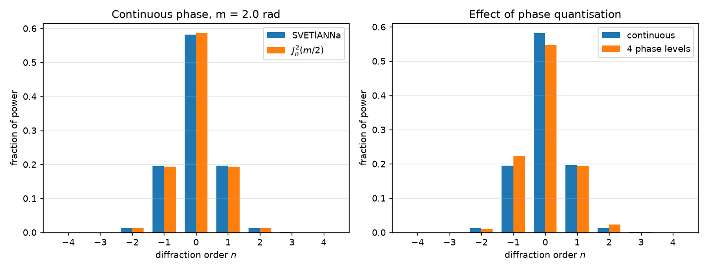

# Diffraction on a sinusoidal phase grating (SLM)

import { Callout, Steps } from 'nextra/components'

A spatial light modulator (SLM) is a pixelated device that imprints a programmable phase
pattern onto a beam. In this tutorial we display a **sinusoidal phase grating** on a
`SpatialLightModulator`, send a Gaussian beam through it and observe the diffraction
orders in the focal plane of a lens. The measured order powers are then compared with the
analytical Bessel-function prediction.

<Callout type="info">
Everything on this page runs on the CPU in a few seconds. All figures below were produced
by the code shown here.
</Callout>

## Theory

A thin phase grating with period $\Lambda$ and peak-to-valley modulation depth $m$ has the
transmission function

$$
t(x) = \exp\left[i\,\frac{m}{2}\sin\left(\frac{2\pi x}{\Lambda}\right)\right].
$$

Expanding it in the Jacobi–Anger series gives

$$
t(x) = \sum_{n=-\infty}^{\infty} J_n\!\left(\frac{m}{2}\right)
       \exp\left(i\,\frac{2\pi n x}{\Lambda}\right),
$$

so the grating splits the beam into discrete diffraction orders. Order $n$ carries the
fraction of power

$$
\eta_n = J_n^2\!\left(\frac{m}{2}\right),
$$

where $J_n$ is the Bessel function of the first kind. A lens of focal length $f$ placed
behind the grating maps each order onto a spot in its focal plane at

$$
x_n = n\,\frac{\lambda f}{\Lambda}.
$$

## Step 1: Simulation grid

<Steps>
### Imports and grid

```python
import math
import numpy as np
import torch
import matplotlib.pyplot as plt

import svetlanna as sv
from svetlanna import SimulationParameters, Wavefront, LinearOpticalSetup
from svetlanna.elements import SpatialLightModulator, ThinLens, FreeSpace
from svetlanna.elements.slm import QuantizerFromStepFunction, one_step_tanh
from svetlanna.units import ureg

params = SimulationParameters.from_ranges(
    x_range=(-2.5 * ureg.mm, 2.5 * ureg.mm), x_points=1024,
    y_range=(-2.5 * ureg.mm, 2.5 * ureg.mm), y_points=1024,
    wavelength=632.8 * ureg.nm,   # HeNe laser
)
```

The grid step is $\Delta x = 5\ \text{mm} / 1024 \approx 4.9\ \mu\text{m}$, which comfortably
resolves both the SLM pixels and the diffraction orders.

### Building the phase mask

The mask is defined on the **SLM pixel grid**, not on the simulation grid — the element
interpolates it onto the simulation grid automatically. Here the modulator has
$400 \times 400$ pixels with an 8 μm pitch, i.e. a 3.2 × 3.2 mm active area.

```python
PITCH  = 8 * ureg.um
NPIX   = 400
PERIOD = 200 * ureg.um    # grating period Λ
DEPTH  = 2.0              # modulation depth m, rad
F      = 150 * ureg.mm    # focal length of the lens

px = (torch.arange(NPIX) - (NPIX - 1) / 2) * PITCH
mask_x, _ = torch.meshgrid(px, px, indexing="xy")

# a sinusoid shifted into [0, m] — SLMs cannot apply a negative phase
mask = (DEPTH / 2) * (1 + torch.sin(2 * math.pi * mask_x / PERIOD))

slm = SpatialLightModulator(
    params,
    mask=mask,
    height=NPIX * PITCH,
    width=NPIX * PITCH,
    mode="nearest",       # how the mask is resampled onto the simulation grid
)
```



<Callout type="info">
`SpatialLightModulator` also acts as an aperture: outside the `height` × `width` rectangle
the field is set to zero.
</Callout>

### Assembling the setup

```python
setup = LinearOpticalSetup([
    slm,
    ThinLens(params, focal_length=F),
    FreeSpace(params, distance=F, method="zpRSC"),
])

incident = Wavefront.gaussian_beam(params, waist_radius=1.0 * ureg.mm)
focal = setup(incident)
```

A Gaussian beam narrower than the modulator is used as illumination: it fills the SLM
smoothly and keeps the focal-plane spots free of the ringing a hard-edged plane wave would
produce. `"zpRSC"` is the zero-padded Rayleigh–Sommerfeld convolution — the safest choice
for propagation over a distance as long as 150 mm.
</Steps>

## Step 2: Diffraction orders

```python
I = focal.intensity.detach()
x = params.x.numpy()

Ix = I.sum(dim=0).numpy()           # integrate along y
spacing = float(632.8 * ureg.nm) * F / PERIOD
print(f"order spacing: {spacing * 1e3:.4f} mm")
```

**Output:**
```
order spacing: 0.4746 mm
```



The five central spots are the $0, \pm 1, \pm 2$ orders, sitting exactly at the predicted
positions (dashed lines). The horizontal fringes around each spot are the diffraction
pattern of the square SLM aperture.

## Step 3: Comparison with theory

Integrating the intensity inside a window of one order spacing around each peak gives the
power in that order:

```python
def order_powers(intensity, orders):
    Ix = intensity.sum(dim=0).numpy()
    out = []
    for n in orders:
        p = n * spacing
        sel = (x > p - spacing / 2) & (x < p + spacing / 2)
        out.append(Ix[sel].sum())
    return np.array(out) / Ix.sum()

def bessel_j(n, z, m=40001):
    """J_n(z) via the integral representation."""
    t = np.linspace(0, np.pi, m)
    return np.trapezoid(np.cos(n * t - z * np.sin(t)), t) / np.pi

orders = np.arange(-4, 5)
measured = order_powers(I, orders)
theory = np.array([bessel_j(n, DEPTH / 2) ** 2 for n in orders])
```

| Order $n$ | SVETlANNa | $J_n^2(m/2)$ |
|-----------|-----------|--------------|
| 0 | 0.5813 | 0.5855 |
| ±1 | 0.1954 / 0.1962 | 0.1936 |
| ±2 | 0.0131 / 0.0125 | 0.0132 |
| ±3 | 0.0006 / 0.0007 | 0.0004 |



The agreement is within a fraction of a percent; the residual comes from the finite
aperture of the modulator, which is not part of the infinite-grating model.

## Step 4: Phase quantisation

A real SLM applies a *discrete* set of phase levels. `SpatialLightModulator` models this
through `lut_function` — a lookup table applied to the mask values. The helper
`QuantizerFromStepFunction` turns any smooth one-step function into a differentiable
quantiser, so a quantised SLM can still be trained end to end.

```python
lut = sv.PartialWithParameters(
    QuantizerFromStepFunction(
        N=4,                       # 4 phase levels
        max_value=DEPTH,
        one_step_function=one_step_tanh,
    ),
    alpha=torch.tensor(30.0),      # steepness of the transition
)

slm_q = SpatialLightModulator(
    params, mask=mask, height=NPIX * PITCH, width=NPIX * PITCH, lut_function=lut,
)
setup_q = LinearOpticalSetup([
    slm_q,
    ThinLens(params, focal_length=F),
    FreeSpace(params, distance=F, method="zpRSC"),
])

measured_q = order_powers(setup_q(incident).intensity.detach(), orders)
```

With four levels the staircase is no longer symmetric, so power leaks asymmetrically into
the neighbouring orders: the $-1$ order grows from 0.195 to 0.224 while the zero order
drops from 0.581 to 0.548 (right-hand panel of the figure above).

<Callout type="warning">
`alpha` controls how sharp the steps are. Large values give a nearly ideal staircase but a
vanishing gradient — start training with a small `alpha` and increase it gradually.
</Callout>

## Full code

```python
import math
import numpy as np
import torch

import svetlanna as sv
from svetlanna import SimulationParameters, Wavefront, LinearOpticalSetup
from svetlanna.elements import SpatialLightModulator, ThinLens, FreeSpace
from svetlanna.units import ureg

params = SimulationParameters.from_ranges(
    x_range=(-2.5 * ureg.mm, 2.5 * ureg.mm), x_points=1024,
    y_range=(-2.5 * ureg.mm, 2.5 * ureg.mm), y_points=1024,
    wavelength=632.8 * ureg.nm,
)

PITCH, NPIX = 8 * ureg.um, 400
PERIOD, DEPTH, F = 200 * ureg.um, 2.0, 150 * ureg.mm

px = (torch.arange(NPIX) - (NPIX - 1) / 2) * PITCH
mask_x, _ = torch.meshgrid(px, px, indexing="xy")
mask = (DEPTH / 2) * (1 + torch.sin(2 * math.pi * mask_x / PERIOD))

setup = LinearOpticalSetup([
    SpatialLightModulator(params, mask=mask,
                          height=NPIX * PITCH, width=NPIX * PITCH),
    ThinLens(params, focal_length=F),
    FreeSpace(params, distance=F, method="zpRSC"),
])

focal = setup(Wavefront.gaussian_beam(params, waist_radius=1.0 * ureg.mm))

x = params.x.numpy()
Ix = focal.intensity.detach().sum(dim=0).numpy()
spacing = float(632.8 * ureg.nm) * F / PERIOD

for n in range(-2, 3):
    sel = (x > n * spacing - spacing / 2) & (x < n * spacing + spacing / 2)
    print(f"order {n:+d}: {Ix[sel].sum() / Ix.sum():.4f}")
```

## Things to try

- Change `DEPTH` to $2.405 \cdot 2$ — the first zero of $J_0$ — and the zero order vanishes.
- Replace the sinusoid with a sawtooth (`torch.remainder`) to obtain a blazed grating that
  sends almost all the power into a single order.
- Rotate the grating by writing `mask` as a function of $x\cos\theta + y\sin\theta$.
- Wrap `mask` in `torch.nn.Parameter` and optimise it — every step above is differentiable.

## See also

- [Laguerre–Gaussian beam](/docs/tutorials/laguerre-gauss) — propagation of a vortex beam
- [Optical elements](/docs/guides/elements) — the full element reference
- [Optimisation](/docs/guides/optimization) — training optical systems
